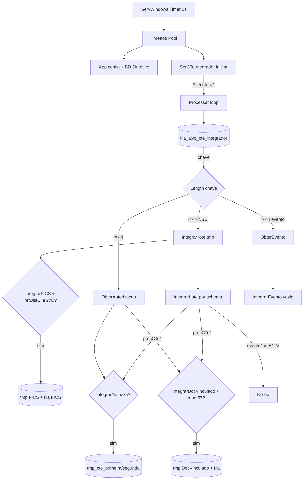

# Análise de Regras de Negócio

**Projeto:** DFEND_CTe_Integrador (Windows Service)  
**Namespace:** `DFe`  
**Caminhos relativos a:** `DFEND_CTe_Integrador/`  
**CodServico:** `7` (`App.config` → `CodServicoIntegrador`)  
**Data da análise:** 2026-07-25  

---

## 1. Resumo executivo

O **DFEND_CTe_Integrador** é um Windows Service (.NET Framework 4.7) que consome a fila Service Broker `fila_alvo_cte_integrador`, roteia mensagens pelo **tamanho da chave** (NSU &lt; 44, chave de acesso = 44, evento composto &gt; 44) e dispara integrações externas:

| Destino | Flag BD | Condição adicional |
|---------|---------|--------------------|
| **Netezza (staging dual)** | `IntegrarNetezza` | Autorização parseada; cancelamento (110111) força `cStat=101` |
| **DocVinculado** | `IntegrarDocVinculado` | Modelo = `57` (CT-e) |
| **FICS** | `IntegrarFICS` | Esquema do lote = `retDistCTeSVD` |

**Achados principais**

- Evento, inutilização e GTV-e são **no-op** explícitos; integração efetiva limita-se à **autorização**.
- `InserirEventoIntegracaoNetezza` existe mas **nunca é chamado** → cancelamento via evento no lote **não** atualiza Netezza.
- Bug FICS: 3º argumento da chamada é `qtd_documento`, gravado em `num_protocolo`.
- Reenvio à fila após erro está **comentado**; reprocessamento depende de `ReEnviarFila` (1×/hora, thread 1).
- `BdCTeHistorico` contém queries em tabelas **MDF-e** (código morto/inadequado neste fluxo).

**Contagens**

| Métrica | Valor |
|---------|-------|
| Regras catalogadas (RN) | **46** |
| Flags de integração/config | **9** |
| Destinos ativos | **3** |
| Tipos com integração real | **1** (autorização) |
| Tipos no-op | **5** |
| Regras duplicadas (pares) | **8** |
| Regras em camada inadequada | **7** |
| Regras sem testes | **46** (projeto sem suíte de testes) |

### Matriz Destino × Tipo (estado atual)

| Tipo no lote / mensagem | Netezza | DocVinculado | FICS |
|-------------------------|---------|--------------|------|
| Autorização CT-e (mod 57) | Sim se flag | Sim se flag | Não (por doc) |
| Autorização CT-e OS / Simp | Sim se parse OK | Só se `mod=57` | Não |
| Evento CT-e | Não (no-op) | Não | Não |
| Inutilização CT-e | Não | Não | Não |
| GTV-e (autorização/evento/inut) | Não | Não | Não |
| Lote `retDistCTeSVD` (nível lote) | — | — | Sim se flag |

FICS é aplicado **no lote** (antes de `IntegrarLote`), não por documento filho.

---

## 2. Arquitetura identificada

| Camada | Componentes (relativos a `DFEND_CTe_Integrador/`) | Bancos |
|--------|--------------------------------------------------|--------|
| Host | `ServWindows.cs` | — |
| Orquestração | `Threads.cs`, `Classes CTe/SerCTeIntegrador.cs` | — |
| Documentos | `Classes CTe/DocCTe.cs`, `DocCTeEvent.cs`, `DocCTeInut.cs` | — |
| Persistência | `Classes CTe/BdCTeSintetico.cs`, `BdCTeAnalitico.cs`, `BdCTeHistorico.cs`, `BdCTeStaging.cs` | Sintético, Analítico, Histórico (`BDNFeDefinitivo`), Staging |
| Infra | `Bibliotecas/Facilitador.cs`, `AcessoDados.cs`, `Log.cs`, `Criptografia.cs`, `Constante.cs` | — |

**Fluxo resumido:** a cada ciclo a thread instancia `SerCTeIntegrador`, lê flags do BD, opcionalmente reenvia itens da temp para a fila (1×/hora, thread 1), faz `RECEIVE` na Service Broker até esvaziar. Item NSU → XML do lote → integrações → `DELETE` da temp.

**Filas Service Broker**

| Fila / contrato | Uso |
|-----------------|-----|
| `fila_alvo_cte_integrador` / `contrato_cte_integrador` | Entrada do Integrador |
| `fila_alvo_integracao_cte_fics` / `contrato_integracao_cte_fics` | Saída FICS |
| `fila_alvo_integracao_cte_doc_vinculado` / `contrato_integracao_cte_doc_vinculado` | Saída DocVinculado |

**Tabelas-chave**

| Tabela | Papel |
|--------|-------|
| `cte.tmp_integracao_conhecimento_transporte_eletronico` | Staging de entrada (lote) |
| `cte.tmp_integracao_…_fisc_icms` | Staging outbound FICS |
| `cte.tmp_integracao_…_doc_vinculado` | Staging outbound DocVinculado |
| `cte.tmp_conhecimento_transporte_eletronico_primeira/segunda` | Staging Netezza (semáforo) |
| `cte.controle_execucao_carga_conhecimento_transporte_eletronico` | Semáforo 1/2 |
| `cte.documento_conhecimento_transporte_eletronico_autorizacao` | XML autorização (sintético) |
| `cte.documento_conhecimento_transporte_eletronico_evento` | XML evento (sintético) |

---

## 3. Catálogo de regras

Formato por regra: **RN-XXX | Nome | Descrição | Tipo | Arquivo | Classe | Método | Linha aprox | Trecho curto | Localização | Duplicidades | Riscos | Testes**

### 3.1 Configuração e ciclo de vida

**RN-001 | Gate Executar | Só processa se `Executar == 1`; caso contrário apenas registra log de processo não iniciado. | Flag | Classes CTe/SerCTeIntegrador.cs | SerCTeIntegrador | Iniciar | ~101 | `if (intExecutar == 1)` | Config BD serviço 7 | Padrão família DFe | Serviço “ligado” mas inerte se flag=0 | Ausente — cobrir Executar 0/1**

**RN-002 | Flags de integração | Carrega do BD: `IntegrarNetezza`, `IntegrarDocVinculado`, `IntegrarFICS`, `ReEnviarFila`, `QtdeMaxFila`, logs (`LogEvento`, `LogBanco`, `LogCompleto`). | Flag | Classes CTe/SerCTeIntegrador.cs | SerCTeIntegrador | ObterConfigBanco | ~76–81 | `intIntegrarNetezza = …` | `cte.configuracao_*` sintético | Espelha Sintetizador | Config ausente → `FormatException` (RN-046) | Ausente — config completa obrigatória**

**RN-003 | Intervalo e Threads | Pool de N threads; `Thread.Sleep(Intervalo)` entre ciclos; recria `SerCTeIntegrador` a cada ciclo. | Flag | Threads.cs | Threads | ObterConfigBancoCTeIntegrador / Run | ~177–178, ~108 | `Thread.Sleep((int)(dblIntervalo))` | Config BD | — | Overhead de recriação; `static intContThread` race | Ausente — carga com N threads**

**RN-004 | CodServico Integrador = 7 | Serviço identificado como Integrador via AppSettings. | Infra | App.config | — | — | ~14 | `CodServicoIntegrador` value=`7` | AppSettings | — | Código acoplado ao config | Ausente — deploy por ambiente**

**RN-005 | Atualizar nome do servidor | Atualiza `nom_servidor` no BD se `MachineName` **não** começa com `SF`. | Infra | Threads.cs | Threads | ObterConfigBancoCTeIntegrador | ~181–184 | `!Environment.MachineName.ToUpper().StartsWith("SF")` | BD sintético | — | Hosts SF não registram heartbeat | Ausente — host SF vs não-SF**

**RN-006 | Timer único no OnStart | Timer 1s dispara pool uma vez; OnElapsed desabilita e descarta o timer (não reagenda). | Infra | ServWindows.cs | ServWindows | OnElapsedEvent | ~131–149 | `tmrCronometro.Enabled = false` | Windows Service | — | Restart só via serviço | Ausente — Start/Stop serviço**

### 3.2 Fila, roteamento e elegibilidade

**RN-007 | Consumo fila Integrador | `RECEIVE TOP(1)` de `fila_alvo_cte_integrador` e encerra conversa Service Broker. | Persistência | Classes CTe/BdCTeSintetico.cs | BdCTeSintetico | RetirarFilaIntegrador | ~2177 | `FROM fila_alvo_cte_integrador` | Service Broker | Mesmo padrão Analisador/Sintetizador/FICS/DocVinc | Contenção multi-thread | Ausente — race de threads**

**RN-008 | Loop até fila vazia | `while (Processar())` enquanto houver chave. | Roteamento | Classes CTe/SerCTeIntegrador.cs | SerCTeIntegrador | Iniciar | ~117–121 | `bolExecutar = this.Processar()` | Memória | — | Pode monopolizar thread em fila grande | Ausente — fila grande**

**RN-009 | Roteamento por tamanho da chave | `<44` → Integrar(NSU); `==44` → ObterAutorizacao; `>44` → ObterEvento. | Roteamento | Classes CTe/SerCTeIntegrador.cs | SerCTeIntegrador | Processar | ~163–177 | `strChave.Length < 44` / `== 44` / `> 44` | Corpo mensagem SB | Crítico para o fluxo | Chave malformada (ex.: 43 chars) tratada como NSU | Ausente — chaves 15, 44, composta**

**RN-010 | Chave de evento composta | Partes `chave;tipo;seq` separadas por `;`. | Parsing | Classes CTe/SerCTeIntegrador.cs; Bibliotecas/Facilitador.cs | SerCTeIntegrador / Facilitador | ObterEvento / ObterParteChave | ~478–480 / ~337 | `ObterParteChave(strChave, 0..2)` | Mensagem fila | — | Índice fora → exception | Ausente — formatos válidos/inválidos**

**RN-011 | Data de referência AAMM | `20` + posições 2–3 (AA) + 4–5 (MM) da chave de acesso. | Parsing | Bibliotecas/Facilitador.cs | Facilitador | ObterDataReferencia | ~18–22 | `return ("20" + …)` | Partição tabelas | Toda a família DFe | Prefixo século `20` hardcoded | Ausente — chaves 20xx**

**RN-012 | Lote só se temp existir | Integra NSU apenas se houver linha em `tmp_integracao_conhecimento_transporte_eletronico`. | Elegibilidade | Classes CTe/SerCTeIntegrador.cs | SerCTeIntegrador | Integrar | ~205 | `Rows.Count > 0` | Temp sintético | — | Mensagem órfã (fila sem temp) só loga | Ausente — NSU sem temp**

**RN-013 | Autorização exige XML no sintético | `ObterAutorizacao(dtr, chave)` obrigatório para chave 44. | Elegibilidade | Classes CTe/SerCTeIntegrador.cs | SerCTeIntegrador | ObterAutorizacao | ~436–458 | `clsBDSin.ObterAutorizacao` | `cte.documento_…_autorizacao` | — | Sem registro → não integra | Ausente — chave sem XML**

**RN-014 | Evento exige XML no sintético (ainda no-op) | Busca evento no sintético; integração subsequente é vazia (RN-018). | Elegibilidade / Gap | Classes CTe/SerCTeIntegrador.cs | SerCTeIntegrador | ObterEvento | ~483 | `ObterEvento(…)` | `cte.documento_…_evento` | — | Trabalho inútil na fila | Ausente — evento na fila**

### 3.3 Regras por tipo de documento (lote)

**RN-015 | Descompactar procComp obrigatório | Item do lote deve conter `procComp`; senão lança exceção. | Parsing | Bibliotecas/Facilitador.cs | Facilitador | DescompactarProc | ~807–829 | `throw … "Lote não compactado"` | XML lote | — | Lote não gzip falha o NSU inteiro | Ausente — compactado/não**

**RN-016 | Schema fallback | Se atributo `schema` vazio, deriva de tags GTVe / CTeOS / CTeSimp / CTe. | Parsing | Classes CTe/SerCTeIntegrador.cs; Bibliotecas/Facilitador.cs | SerCTeIntegrador / Facilitador | IntegrarLote / ObterEsquemaCTe | ~269–272 / ~372 | `ObterEsquemaCTe` | XML | DocCTe também classifica schema | Schema errado → ramo errado | Ausente — schemas mistos**

**RN-017 | Autorização CT-e por prefixo schema | `schema.StartsWith("procCTe")` → `IntegrarAutorizacao`. | Roteamento | Classes CTe/SerCTeIntegrador.cs | SerCTeIntegrador | IntegrarLote | ~275–278 | `EsqCTeAutorizacaoSchema` | Lote | Conflita com OS/Simp (`procCTeOS`, `procCTeSimp`) | Prefix match ambíguo | Ausente — schemas OS/Simp**

**RN-018 | Evento CT-e → no-op | `procEventoCTe` instancia `DocCTeEvent` mas não integra. | Gap | Classes CTe/SerCTeIntegrador.cs | SerCTeIntegrador | IntegrarEvento | ~362 | `// Nao existe integracao` | — | Método morto RN-038 | Cancelamento via evento não atualiza Netezza | Ausente — evento cancelamento no lote**

**RN-019 | Inutilização CT-e → no-op | `procInutCTe` sem integração. | Gap | Classes CTe/SerCTeIntegrador.cs | SerCTeIntegrador | IntegrarInutilizacao | ~385 | comentário no-op | — | — | Inut nunca vai staging/FICS/DocVinc | Ausente — inut no lote**

**RN-020 | GTV Autorização → no-op | `procGTVe` vazio. | Gap | Classes CTe/SerCTeIntegrador.cs | SerCTeIntegrador | IntegrarAutorizacaoGTV | ~403 | comentário | — | — | GTV não vai Netezza | Ausente — GTV**

**RN-021 | GTV Evento/Inutilização → no-op | Métodos vazios. | Gap | Classes CTe/SerCTeIntegrador.cs | SerCTeIntegrador | IntegrarEventoGTV / IntegrarInutilizacaoGTV | ~412, ~421 | comentário | — | — | — | Ausente**

**RN-022 | Schema inesperado falha lote | Qualquer outro schema → `Exception` com `MsgLoteElementoNaoEsperado`. | Elegibilidade | Classes CTe/SerCTeIntegrador.cs | SerCTeIntegrador | IntegrarLote | ~305–308 | `MsgLoteElementoNaoEsperado` | Lote | — | Falha NSU + marca erro temp (RN-042) | Ausente — schema novo**

**RN-023 | Parse multi-schema DocCTe | Aceita GTVe, CTeOS, CTeSimp (`cteProcSimp`/`cteSimpProc`), procCTe. | Parsing | Classes CTe/DocCTe.cs | DocCTe | PreencherPropriedades | ~446–473 | branches schema | XML | RN-016/017 | Null em tag esperada → throw | Ausente — XML OS/Simp/GTVe**

**RN-024 | Tomador toma03/toma3/toma4 | Extrai tomador de variantes em `ide` e bloco `toma`. | Parsing | Classes CTe/DocCTe.cs | DocCTe | PreencherPropriedadesIdentificacao / PreencherPropriedadesTomador | ~595–736 | `toma03` / `toma3` / `toma4` | XML | — | Tomador incompleto no staging | Ausente — layouts antigos/novos**

**RN-025 | Valores vPrest vs total | Bloco `total` sobrescreve valores de `vPrest` se presente. | Parsing | Classes CTe/DocCTe.cs | DocCTe | PreencherPropriedadesTotal | ~856–863 | `ValorTotal = total.vTPrest` | Staging valores | — | Ambíguo se ambos existem | Ausente — CTeSimp vs normal**

**RN-026 | ICMS variantes flat | ICMS00/20/45/60/90/OutraUF/SN mapeados para campos únicos. | Parsing | Classes CTe/DocCTe.cs | DocCTe | PreencherPropriedadesImposto | ~877–941 | `ICMS00`… | Staging | — | Último bloco presente “ganha” se múltiplos | Ausente — cada CST**

**RN-027 | Quantidade NFes vinculadas | Conta `infNFe` em `infCTeNorm`. | Parsing | Classes CTe/DocCTe.cs | DocCTe | PreencherPropriedadesCTeNormal | ~955 | `GetElementsByTagName("infNFe").Count` | Staging `qtd_…` | — | Sem `infCTeNorm` → 0 | Ausente — CTe com/sem NFe**

**RN-028 | Ano inutilização 2 dígitos | Se `Ano.Length != 4` → `2000 + ano`. | Parsing | Classes CTe/DocCTeInut.cs | DocCTeInut | PreencherPropriedadesEnvio | ~204–208 | `2000 + Convert…` | (não usado na integração) | — | Código efetivamente morto no fluxo Integrador | Ausente**

### 3.4 Integração FICS

**RN-029 | FICS só se flag + esquema SVD | `IntegrarFICS==1` **e** `des_esquema == retDistCTeSVD`. | Flag / Elegibilidade | Classes CTe/SerCTeIntegrador.cs | SerCTeIntegrador | Integrar | ~222–225 | `intIntegrarFICS == 1 && strEsquema == EsqCTeRetSVD` | Lote temp | — | Outros esquemas nunca vão FICS | Ausente — flag on/off + esquema**

**RN-030 | Persistência e fila FICS | Insert em `tmp_integracao_…_fisc_icms` + SEND Service Broker FICS. | Integração | Classes CTe/SerCTeIntegrador.cs; Classes CTe/BdCTeAnalitico.cs | SerCTeIntegrador / BdCTeAnalitico | EnviarIntegracaoFICS / InserirTempFilaFICS / EnviarFilaFICS | ~780–786 / ~502 / ~566 | `servico_iniciador_integracao_cte_fics` | BD Analítico | Padrão DocVinculado (RN-041) | **Bug:** 3º arg chamado com `strQtde` mas param nomeado `strProtocolo` → quantidade em `num_protocolo` | Ausente — insert campos; PK duplicate**

**RN-031 | Idempotência FICS | Exception contendo `PRIMARY KEY` ou `DUPLICATE KEY` → log, não propaga. | Idempotência | Classes CTe/SerCTeIntegrador.cs | SerCTeIntegrador | EnviarIntegracaoFICS | ~794–798 | `Contains("PRIMARY KEY")` | Catch | RN-037, RN-041 | Dependência de texto de erro SQL | Ausente — reenvio mesmo NSU**

### 3.5 Integração Netezza (Staging)

**RN-032 | Gate Netezza | Só executa se `IntegrarNetezza == 1`. | Flag | Classes CTe/SerCTeIntegrador.cs | SerCTeIntegrador | IntegrarAutorizacao | ~330 | `intIntegrarNetezza == 1` | Config | — | — | Ausente — flag**

**RN-033 | Cancelamento força status 101 | Se existe evento cancelamento (110111) no Sintético **ou** Histórico, seta `Status="101"` e motivo “Cancelamento de NF-e homologado”. | Status | Classes CTe/SerCTeIntegrador.cs | SerCTeIntegrador | InserirAutorizacaoIntegracaoNetezza | ~635–643 | `TipoEvento.Cancelamento` / `Status = "101"` | Sin + His | Texto de NF-e (inadequado CT-e) | Mensagem errada; seq histórico hardcoded `"1"` | Ausente — autorizada vs cancelada**

**RN-034 | Semáforo dual-table | Lê `num_controle_execucao_carga`: 1→`_primeira`, 2→`_segunda`. | Staging | Classes CTe/BdCTeStaging.cs | BdCTeStaging | ObterSemaforoCTe / InserirDFe | ~47–50 / ~142–146 | `if (intSemaforo == 2)` | Controle carga | — | `TrocarSemaforoCTe` nunca chamado neste serviço | Ausente — semáforo 1/2**

**RN-035 | Delete-before-insert staging | Antes de inserir, `DELETE TOP(1)` por `dtr_referencia + cod_chave_acesso`. | Staging | Classes CTe/SerCTeIntegrador.cs; Classes CTe/BdCTeStaging.cs | SerCTeIntegrador / BdCTeStaging | InserirAutorizacaoIntegracaoNetezza / ExcluirDFe | ~649 / ~409 | `DELETE TOP(1)` | Staging temp | — | Só remove 1 linha; duplicatas residuais possíveis | Ausente — reintegração mesma chave**

**RN-036 | Insert flatten CT-e no staging | Grava campos fiscais, XMLs e `cod_situacao` = Status do Doc. | Integração | Classes CTe/BdCTeStaging.cs | BdCTeStaging | InserirDFe | ~149–367 | INSERT colunas staging | `tmp_conhecimento_transporte_eletronico_*` | Espelha insert Histórico (não usado aqui) | Trunc/cast de tipos | Ausente — happy path**

**RN-037 | Idempotência Netezza | PK/DUPLICATE → log “já existente”. | Idempotência | Classes CTe/SerCTeIntegrador.cs | SerCTeIntegrador | InserirAutorizacaoIntegracaoNetezza | ~660–664 | `PRIMARY KEY` | Catch | RN-031 | Race delete/insert | Ausente — concorrência**

**RN-038 | Evento→Netezza (código morto) | Se cancelamento, busca autorização e re-chama insert Netezza — **nunca chamado** por `IntegrarEvento`. | Gap / Dead | Classes CTe/SerCTeIntegrador.cs | SerCTeIntegrador | InserirEventoIntegracaoNetezza | ~684–709 | `if TipoEvento == Cancelamento` | — | RN-033 parcial; RN-018 | Cancelamento só na autorização se evento já estiver no BD | Ausente — chamar via IntegrarEvento**

### 3.6 Integração DocVinculado

**RN-039 | Gate DocVinculado | `IntegrarDocVinculado == 1`. | Flag | Classes CTe/SerCTeIntegrador.cs | SerCTeIntegrador | IntegrarAutorizacao | ~336 | `intIntegrarDocVinculado == 1` | Config | — | — | Ausente — flag**

**RN-040 | Só modelo 57 | Integra DocVinculado apenas se `Modelo == "57"`. Exclui OS 67, GTVe 64, etc. | Elegibilidade | Classes CTe/SerCTeIntegrador.cs | SerCTeIntegrador | InserirAutorizacaoIntegracaoDocVinculado | ~734 | `clsDoc.Modelo == Constante.ModeloCTe` | Analítico | — | CTe OS/Simp com mod≠57 silenciosamente ignorados | Ausente — modelo 57 vs 67**

**RN-041 | Persistência e fila DocVinculado | Insert temp + SEND `cte_doc_vinculado`; idempotência PK/DUPLICATE. | Integração / Idempotência | Classes CTe/BdCTeAnalitico.cs; Classes CTe/SerCTeIntegrador.cs | BdCTeAnalitico / SerCTeIntegrador | InserirTempFilaDocVinculado / EnviarFilaDocVinculado / InserirAutorizacaoIntegracaoDocVinculado | ~709 / ~775 / ~749 | tabelas/filas doc_vinculado | BD Analítico | Espelha FICS (RN-030/031) | Schema Doc pode estar vazio se não setado no parse | Ausente — insert + fila**

### 3.7 Reprocessamento, erro e limpeza

**RN-042 | Erro marca temp, não reenvia | `AtualizarTempFilaIntegradorErro`; reenvio à fila **comentado**. | Reprocessamento | Classes CTe/SerCTeIntegrador.cs | SerCTeIntegrador | AtualizarErro | ~528–537 | `// EnviarFilaIntegrador` | Temp + fila | — | Item some da SB; só volta via ReEnviarFila | Ausente — forçar exception**

**RN-043 | ReEnviarFila horário | Se `ReEnviarFila==1`, mudança de hora e `intThread==1`, reenvia TOP(`QtdeMaxFila`) NSUs da temp. | Reprocessamento | Classes CTe/SerCTeIntegrador.cs | SerCTeIntegrador | Iniciar / ReEnviarFila | ~107–113 / ~581 | `Hour != Now.Hour && Thread==1` | Temp → fila | — | Sem filtro de erro; race `intContThread` static | Ausente — virada de hora**

**RN-044 | Capacidade máxima da fila | Só reenvia se `COUNT(fila) < QtdeMaxFila`. | Reprocessamento | Classes CTe/SerCTeIntegrador.cs | SerCTeIntegrador | ReEnviarFila | ~581 | `ObterQtdeFilaIntegrador() < intQtdeMaxFila` | SB | — | Fila cheia → backlog na temp | Ausente — fila acima do max**

**RN-045 | Excluir temp pós-sucesso | Após `IntegrarLote` (mesmo com GTV no-op), apaga temp do NSU. | Persistência | Classes CTe/SerCTeIntegrador.cs | SerCTeIntegrador | ExcluirLote | ~558 | `ExcluirTempFilaIntegrador` | Temp | — | Se FICS OK e IntegrarLote falha → FICS já enviado, temp permanece | Ausente — falha mid-lote**

**RN-046 | Config obrigatória | Item de config arquivo/banco nulo/vazio → `FormatException`. | Infra | Bibliotecas/Facilitador.cs | Facilitador | ValidarItemConfigArquivo / ValidarItemConfigBanco | ~860–883 | `throw new FormatException` | Startup | — | Serviço não sobe | Ausente — remover config**

---

## 4. Regras duplicadas (tabela)

| Par / grupo | Onde | Natureza da duplicidade | Impacto | Ação sugerida |
|-------------|------|-------------------------|---------|---------------|
| RN-031 / RN-037 / catch DocVinculado (RN-041) | `SerCTeIntegrador` (3 métodos) | Mesmo tratamento `PRIMARY KEY` / `DUPLICATE KEY` | Manutenção triplicada; texto SQL frágil | Extrair `IsDuplicateKey(Exception)` |
| RN-030 / RN-041 | `BdCTeAnalitico` FICS vs DocVinculado | Shape de temp + SEND SB quase idênticos | Copy-paste; bug em um lado não no outro | Template genérico de fila outbound |
| RN-007 vs filas FICS/DocVinc | `BdCTeSintetico` / `BdCTeAnalitico` | Padrão RECEIVE/END CONVERSATION repetido | Divergência de timeout/erro | Helper Service Broker |
| RN-016 / RN-023 | `Facilitador.ObterEsquemaCTe` + `DocCTe.PreencherPropriedades` | Classificação de schema em dois lugares | Risco de ramos divergentes | Única fonte de verdade de schema |
| RN-011 | `Facilitador` (família DFe) | Mesma regra de data referência em todos os serviços | OK se lib compartilhada; aqui é cópia local | Extrair lib comum |
| `BdCTeSintetico` filas Sintetizador/Analisador | `BdCTeSintetico.cs` | APIs de outras etapas no mesmo Bd do Integrador | Ruído; risco de uso acidental | Separar Bd por bounded context |
| RN-033 motivo vs `Constante.ObterMensagem(101)` | `SerCTeIntegrador` vs `Constante` | Texto “Cancelamento de NF-e…” hardcoded | Mensagem fiscal inadequada a CT-e | Usar constante CT-e |
| Insert staging RN-036 vs `BdCTeHistorico.InserirDadosCTeAutorizacao` | Staging vs Histórico | Campos flatten muito similares | Drift de mapeamento | DTO + mapper único |

---

## 5. Regras em camadas inadequadas (tabela)

| RN | Onde está | Camada esperada | Problema | Severidade |
|----|-----------|-----------------|----------|------------|
| RN-009 | `SerCTeIntegrador.Processar` | Domain/Routing policy | Heurística de tamanho de string como contrato de mensagem | Alta |
| RN-017 | `IntegrarLote` (`StartsWith`) | Schema classifier | Prefixo ambíguo misturando CTe/OS/Simp | Alta |
| RN-030 bug qtde→protocolo | Orquestração + Bd | Contrato de integração | Parâmetro mal nomeado/passado na camada de aplicação | Crítica |
| RN-033 | Orquestração | Domain (status fiscal) | Regra de cancelamento + texto NF-e embutidos no serviço | Alta |
| RN-038 | Método privado não referenciado | Domain evento | Regra correta na camada errada (morta) | Alta |
| Queries MDF-e em `BdCTeHistorico` | Persistência CT-e | Remover / corrigir CT-e | Camada de dados de outro DF-e | Média |
| RN-015 “Lote não compactado” | `Facilitador` (helper) | Validação de contrato do Integrador | Regra de negócio no utilitário técnico | Média |

---

## 6. Regras sem testes (tabela)

O repositório **não possui** projeto de testes (unit/integration). Todas as RNs carecem de cobertura automatizada. Priorização sugerida:

| Prioridade | RNs | Cenários mínimos sugeridos |
|------------|-----|----------------------------|
| Crítica | RN-009, RN-029, RN-030, RN-033, RN-040, RN-042 | Chaves 15/44/composta; FICS campos; cancelamento→101; modelo 57 vs 67; erro sem reenvio |
| Alta | RN-015, RN-017, RN-018, RN-032, RN-034, RN-035, RN-038 | Compactação; schema OS/Simp; no-op evento; semáforo; delete-before-insert; despertar evento→Netezza |
| Média | RN-001–RN-005, RN-012–RN-014, RN-022, RN-043–RN-045 | Flags; órfãos; schema inválido; reenvio horário; exclusão temp |
| Baixa | RN-023–RN-028, RN-011, RN-016, RN-046 | Parse XML variantes; data referência; config obrigatória |

| RN | Testável? | Status atual | Observação |
|----|-----------|--------------|------------|
| RN-001 … RN-046 | Sim (maioria unit/integration) | **Sem testes** | Criar projeto `DFEND_CTe_Integrador.Tests` |

---

## 7. Plano de refatoração (crítica/alta/média/baixa)

### Crítica

1. **Corrigir chamada FICS (RN-030):** passar protocolo real (ou alinhar coluna/param); validar inserts existentes contaminados.
2. **Corrigir motivo de cancelamento (RN-033):** texto CT-e, não “NF-e”.
3. **Restaurar ou redesenhar reprocessamento pós-erro (RN-042):** reenvio com filtro `des_mensagem_erro`, backoff e limite; status explícito na temp.
4. **Ativar cancelamento por evento (RN-018/RN-038):** chamar `InserirEventoIntegracaoNetezza` quando `IntegrarNetezza==1`, ou documentar e garantir que cancelamento sempre reprocessa a autorização.

### Alta

5. **Classificador de schema ordenado (RN-017):** match GTVe → OS → Simp → CTe (evitar `StartsWith("procCTe")` ambíguo).
6. **Extrair `IntegrationPolicy`:** flags + regras modelo/esquema/tipo evento (matriz Destino × Tipo como código).
7. **Thread-safe thread id (RN-003/043):** `Interlocked` / state no `QueueUserWorkItem`.
8. **Remover ou corrigir queries MDF-e em `BdCTeHistorico`.**
9. **Saga/outbox:** ordem FICS → lote → Netezza/DocVinc com compensação ou outbox único (RN-045).

### Média

10. Unificar idempotência PK (RN-031/037/041).
11. Separar `BdCTeSintetico` só com APIs do Integrador.
12. Template genérico de filas outbound FICS/DocVinculado.
13. Status `sts_processamento` na temp além de `des_mensagem_erro`.
14. Documentar dono do `TrocarSemaforoCTe` (job externo) e monitorar dessincronia.

### Baixa

15. Métricas: processados, no-ops, PK duplicate, erros por destino, lag de fila.
16. Limpar código morto (métodos GTV vazios documentados; inserts Histórico não usados).
17. Suíte de fixtures XML (procCTe / OS / Simp / Evento cancelamento / lote compactado).
18. Extrair lib compartilhada `Facilitador`/`Constante` entre serviços DFe.

---

## Apêndice A — Flags operacionais (serviço 7)

| Flag BD | Efeito |
|---------|--------|
| `Executar` | Liga/desliga processamento |
| `IntegrarNetezza` | Staging dual Netezza |
| `IntegrarDocVinculado` | Temp + fila Analítico DocVinculado (mod 57) |
| `IntegrarFICS` | Temp + fila FICS se esquema `retDistCTeSVD` |
| `ReEnviarFila` | Reinjeta temp→fila 1×/hora (thread 1) |
| `QtdeMaxFila` | Limite COUNT fila + TOP reenvio |
| `Intervalo` / `Threads` | Cadência do pool |
| `LogEvento` / `LogBanco` / `LogCompleto` | Verbosidade |

## Apêndice B — Contagens finais

| Item | Quantidade |
|------|------------|
| Regras de negócio (RN-001 … RN-046) | **46** |
| Pares/grupos duplicados (seção 4) | **8** |
| Regras em camada inadequada (seção 5) | **7** |
| Regras sem testes (seção 6) | **46** |
| Destinos de integração | **3** |
| Itens no plano de refatoração | **18** (4 crítica, 5 alta, 5 média, 4 baixa) |

---

*Fim do relatório. Nenhum código-fonte foi alterado nesta análise.*
