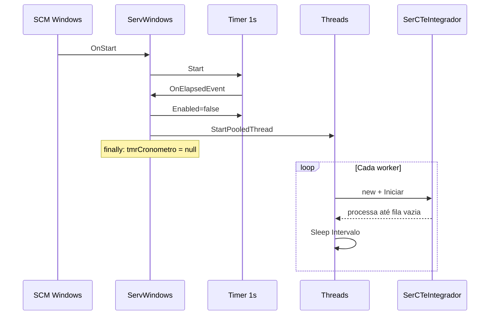
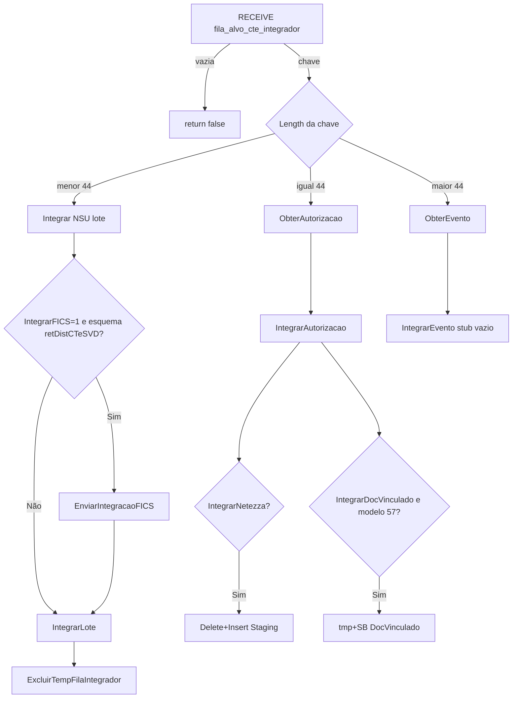
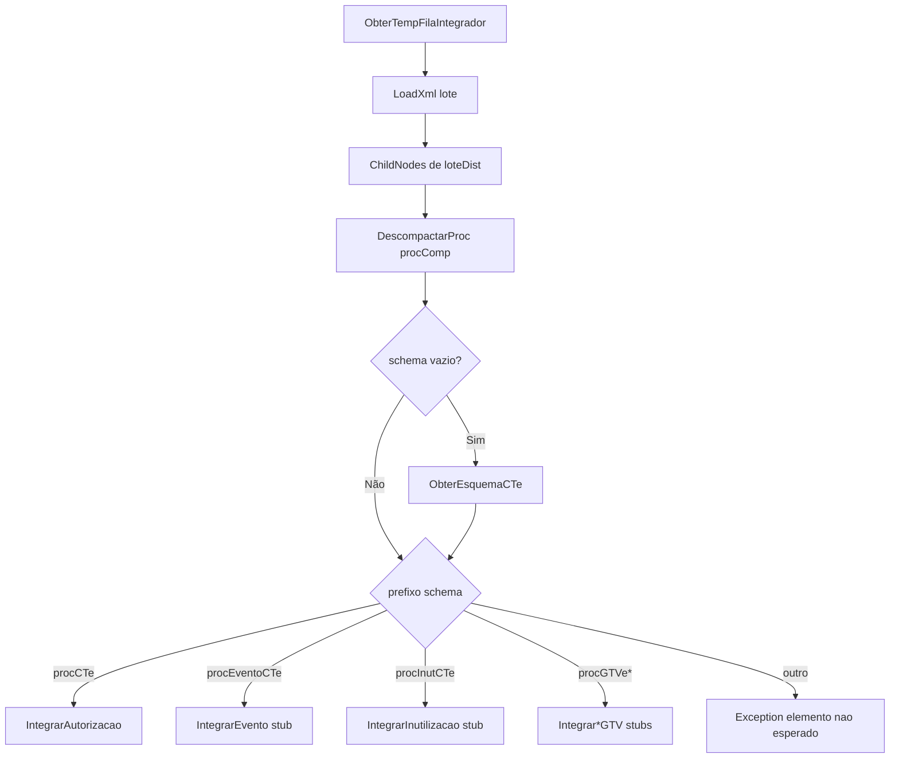
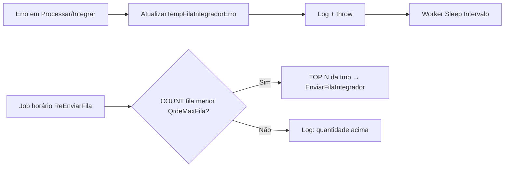
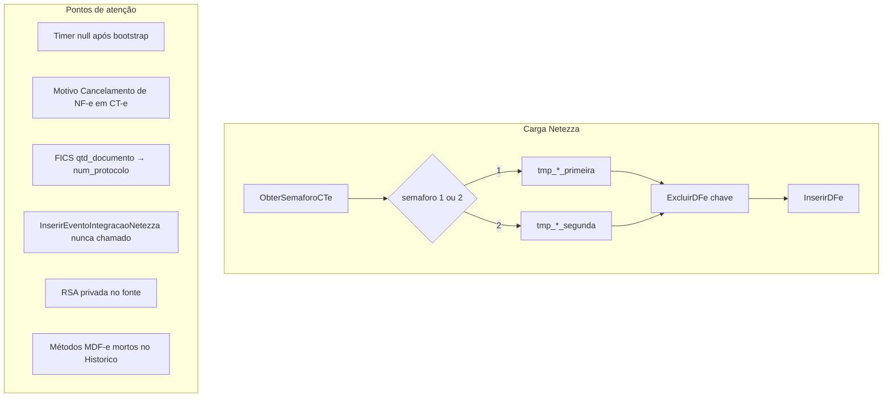
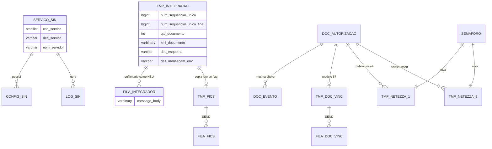
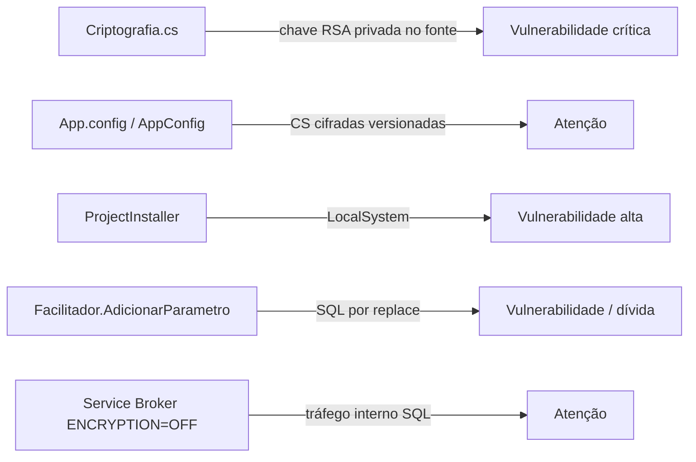

# Documentação Técnica do Sistema — DFEND_CTe_Integrador

> **Documento gerado por análise somente-leitura do código-fonte**  
> **Repositório analisado:** `C:\Users\Mendes\Desktop\Clones\Assefaz\CT_e\5-Integrador\dfend-cte-integrador-windowsservices`  
> **Data da análise:** 25/07/2026  
> **Versão do assembly (código):** 9.0.0 (`AssemblyInfo.cs`)  
> **Último commit local observado:** `d8df098` — `09.00.00`  
> **Estágio no pipeline CT-e:** **5 — Integrador** (integrações externas via SQL/Service Broker; **não** HTTP)

---

## 0. Roteiro de estudo para quem nunca viu o sistema

Ordem sugerida para um desenvolvedor que acabou de chegar (júnior ou sênior):

| Ordem | O quê ler | Por quê |
|------:|-----------|---------|
| 1 | **§1 Resumo Executivo** + **§2 Objetivo** | Entender o “para que serve” em 5 minutos |
| 2 | **§11 Diagrama de Arquitetura** | Ver o mapa mental (como um organograma da fábrica) |
| 3 | **§5 Estrutura** + **§12 Componentes** | Saber onde cada peça mora no disco |
| 4 | **Pontos de entrada:** `ServWindows.cs` → `Threads.cs` → `SerCTeIntegrador.cs` | Caminho que o Windows Service percorre ao ligar |
| 5 | **§13–14 Fluxos** (principal + erro + Netezza/FICS/DocVinculado) | Entender a esteira: fila → XML → destinos externos |
| 6 | **§15 Regras de Negócio (RN-xxx)** | O que o sistema decide e por quê |
| 7 | **§17 Banco de Dados** + Service Broker | Onde os dados ficam e como as “filas de tickets” funcionam |
| 8 | **§22 Segurança** + **§31 Riscos** | Onde ter atenção antes de mexer em produção |
| 9 | **§36 Glossário** + **§38 Escopo** | Fechar lacunas e o que ainda validar com o time |

> **O que importa:** este serviço **não recebe HTTP**. Ele é um **Windows Service** (aplicação instalada no Windows que roda em segundo plano, como um motor ligado 24h) que **consome a fila Service Broker** `fila_alvo_cte_integrador` e **empurra CT-e** para destinos internos de integração: **Netezza (staging)**, **DocVinculado** e **FICS** — sempre via SQL + Service Broker, nunca via SOAP/REST neste assembly.

> **Diferença crítica vs Sintetizador:** aqui **não existe camada `Neg*`**. A orquestração de negócio vive em `SerCTeIntegrador`, com parsers XML em `DocCTe` / `DocCTeEvent` / `DocCTeInut`.

---

## 1. Resumo Executivo

O **DFEND_CTe_Integrador** é um **Windows Service .NET Framework 4.7** da SEFAZ-BA (produto **DFEND** — Documentos Fiscais Eletrônicos) responsável por:

1. Retirar mensagens da fila Service Broker `fila_alvo_cte_integrador` (a “caixa de entrada” de chaves a integrar).
2. Interpretar a mensagem pelo **tamanho da string** (`<44` = NSU de lote; `==44` = chave de autorização; `>44` = chave composta de evento).
3. Para **lote (NSU):** ler `cte.tmp_integracao_conhecimento_transporte_eletronico`, opcionalmente enviar ao **FICS**, descompactar itens `procComp` e integrar autorizações.
4. Para **autorização (44 chars):** buscar XML no sintético e integrar.
5. Para **evento (>44):** buscar XML no sintético — mas a integração de evento está **vazia (stub)**; o método que atualizaria o Netezza em cancelamento **nunca é chamado**.
6. Destinos reais de autorização: **Netezza** (delete+insert em tabela de semáforo) e **DocVinculado** (tmp + SB, só modelo `57`).
7. Em falha, gravar erro na tmp (reenvio imediato comentado); periodicamente (1×/hora, thread 1) reenviar pendências se a fila estiver abaixo do limite.

> **Analogia:** imagine um **despachante de encomendas**. O Arquivador (e eventualmente o Sintetizador) deixa o pacote numa mesa (`tmp_integracao_*`) e coloca um bilhete na esteira (`fila_alvo_cte_integrador`). O Integrador lê o bilhete: se for um número de lote, abre a caixa e envia cartas para três caixas-postais (Netezza, DocVinculado, FICS). Se for uma chave de 44 dígitos, busca a carta no arquivo sintético e despacha. Eventos e GTV hoje são “formulários em branco” — o código existe, mas não faz nada.

> **Ponto forte:** flags granulares no banco (`IntegrarNetezza`, `IntegrarDocVinculado`, `IntegrarFICS`) permitem ligar/desligar destinos sem recompilar.  
> **Atenção:** chave RSA privada hardcoded; serviço como `LocalSystem`; timer anulado após bootstrap; Motivo de cancelamento copia texto de NF-e; FICS grava `qtd_documento` no campo `num_protocolo`; eventos não atualizam Netezza; código morto MDF-e em `BdCTeHistorico`; sem testes; sem HTTP/SOAP.

---

## 2. Objetivo do Sistema

**Objetivo comprovado pelo código:** consumir a fila do Integrador e **propagar documentos CT-e já sintetizados** para sistemas consumidores internos (staging Netezza / FICS / DocVinculado), garantindo:

- Roteamento por tipo de mensagem (NSU × chave × evento composto).
- Integração seletiva por flags de configuração.
- Idempotência parcial (duplicidade de PK tratada como “já existente”).
- Operação contínua via threads em loop.

**Evidência:** `AssemblyInfo.cs` descreve `"Serviço Integrador de CT-e"`; fluxo em `SerCTeIntegrador.Iniciar` / `Processar` / `Integrar` / `IntegrarAutorizacao`; `CodServicoIntegrador=7` no `App.config`.

---

## 3. Contexto de Negócio

| Conceito | Significado simples | Onde aparece no código |
|----------|---------------------|------------------------|
| **CT-e** | Conhecimento de Transporte Eletrônico (documento fiscal de frete) | `Constante.SiglaCTe`, schemas `procCTe*` |
| **GTV-e** | Guia de Transporte de Valores eletrônica | schemas `procGTVe*` — **stubs vazios** neste serviço |
| **NSU** | Número Sequencial Único da distribuição SVD | chave da fila quando `Length < 44` |
| **Chave de acesso** | Identificador de 44 dígitos do DF-e | roteamento `Length == 44` |
| **Chave de evento** | Composta (`chave|tipo|seq` ou similar via `ObterParteChave`) | roteamento `Length > 44` |
| **Netezza / Staging** | Base de carga analítica (tabelas tmp + semáforo 1/2) | `BdCTeStaging` |
| **FICS** | Integração fiscal ICMS (fila/tmp no analítico) | `EnviarIntegracaoFICS` |
| **DocVinculado** | Integração de documentos vinculados (só modelo 57) | `InserirAutorizacaoIntegracaoDocVinculado` |
| **Sintético** | Base resumida de onde o Integrador **lê** XML e config | `BdCTeSintetico`, `CodServico=7` |
| **DFEND** | Ecossistema SEFAZ-BA de DF-e | `Constante.VersaoDFEND`, nome do serviço |
| **Service Broker** | Fila interna do SQL Server | `BEGIN DIALOG` / `RECEIVE` |

> **Inferência técnica:** o Integrador é a **etapa 5** do pipeline CT-e (Receptor → Arquivador → Sintetizador → Analisador → **Integrador**). Quem **produz** a fila: o **Arquivador** (comprovado no relatório de contexto); o Sintetizador possui método de envio; o **Analisador não referencia** essa fila.

> **Não confirmado:** scripts DDL do banco; consumidor final da fila FICS/DocVinculado; job que troca o semáforo Netezza (`TrocarSemaforoCTe` existe no código mas **não é chamado** por `SerCTeIntegrador`).

---

## 4. Visão Geral da Solução

```
┌──────────────────────────────────────────────────────────────────────────┐
│  Windows Service: DFEND_CTe_Integrador                                   │
│  Entrada: ServWindows.Main / OnStart                                     │
│                                                                          │
│  Timer 1s (bootstrap) → Threads (N workers em loop)                      │
│       ↓                                                                  │
│  SerCTeIntegrador (orquestração — SEM Neg*)                              │
│       ↓                                                                  │
│  DocCTe / DocCTeEvent / DocCTeInut (parse XML)                           │
│       ↓                                                                  │
│  BdCTeSintetico  → BDCTeSintetico (config, fila, tmp, docs)              │
│  BdCTeAnalitico  → BDCTeAnalitico (FICS + DocVinculado tmp/SB)           │
│  BdCTeHistorico  → BDNFeDefinitivo (fallback cancelamento/autorização) │
│  BdCTeStaging    → BDStaging / Netezza (semaforo + insert/delete)        │
└──────────────────────────────────────────────────────────────────────────┘
```

**Tipo:** worker batch contínuo (não API, não UI).  
**Solução Visual Studio:** 1 projeto único (`DFEND_CTe_Integrador.sln`).

---

## 5. Estrutura do Repositório

```
dfend-cte-integrador-windowsservices/
├── azure-pipelines.yml                 # CI Azure DevOps (build .NET Framework)
├── DFEND_CTe_Integrador.sln            # Solução VS 2017+
└── DFEND_CTe_Integrador/
    ├── ServWindows.cs                  # Entrada Windows Service
    ├── ServWindows.Designer.cs
    ├── Threads.cs                      # Pool de threads + config
    ├── ProjectInstaller*.cs            # Instalação do serviço Windows
    ├── App.config                      # Config local (appSettings)
    ├── App.Release.config              # Transform Release (token CI)
    ├── AppConfig/
    │   ├── Desenvolvimento/
    │   ├── Homologacao/
    │   └── Producao/                   # exe.config por ambiente
    ├── Bibliotecas/
    │   ├── AcessoDados.cs              # ADO.NET / transações
    │   ├── Criptografia.cs             # RSA encrypt/decrypt connection string
    │   ├── Constante.cs                # Constantes DF-e / mensagens
    │   ├── Facilitador.cs              # Helpers XML/CPF/CNPJ/GZip
    │   └── Log.cs                      # Event Log + log em banco
    ├── Classes CTe/
    │   ├── SerCTeIntegrador.cs         # Serviço / orquestração (sem Neg*)
    │   ├── DocCTe.cs                   # Modelo/parse autorização
    │   ├── DocCTeEvent.cs              # Modelo/parse evento
    │   ├── DocCTeInut.cs               # Modelo/parse inutilização
    │   ├── BdCTeSintetico.cs           # SQL sintético + SB Integrador
    │   ├── BdCTeAnalitico.cs           # SQL analítico + SB FICS/DocVinculado
    │   ├── BdCTeHistorico.cs           # SQL histórico (procs + código morto MDF-e)
    │   └── BdCTeStaging.cs             # SQL staging Netezza (semáforo)
    └── Properties/
        └── AssemblyInfo.cs             # Versão 9.0.0 — © SEFAZ 2018
```

**Não encontrados neste repositório:** testes, Dockerfile, docker-compose, migrations SQL, README, controllers HTTP, camada `Neg*`, NuGet packages externos além do BCL.

---

## 6. Projetos e Módulos

| Projeto | Tipo | Papel |
|---------|------|-------|
| `DFEND_CTe_Integrador` | `WinExe` / Windows Service | Único executável do sistema |

### Módulos lógicos (pastas)

| Pasta / arquivo | Responsabilidade |
|-----------------|------------------|
| `ServWindows` | Ciclo de vida do serviço Windows |
| `Threads` | Bootstrap de workers e leitura de config (4 connection strings) |
| `SerCTeIntegrador` | Loop de processamento, flags, roteamento, integrações |
| `DocCTe*` | Extração de campos do XML CT-e |
| `BdCTeSintetico` | Config (`CodServico=7`), fila Integrador, tmp, leitura de docs |
| `BdCTeAnalitico` | Filas/tmp FICS e DocVinculado |
| `BdCTeHistorico` | Fallback em base definitiva (autorização/evento) |
| `BdCTeStaging` | Semáforo e carga Netezza |
| `Bibliotecas/*` | Infra transversal (log, crypto, helpers, ADO) |

Namespace root: **`DFe`**.

---

## 7. Tecnologias Utilizadas

| Tecnologia | Evidência | Uso |
|------------|-----------|-----|
| **C# / .NET Framework 4.7** | `.csproj` / `App.config` `sku=".NETFramework,Version=v4.7"` | Linguagem e runtime |
| **System.ServiceProcess** | `ServWindows : ServiceBase` | Windows Service |
| **System.Timers.Timer** | `ServWindows.OnStart` | Disparo inicial dos workers |
| **ThreadPool** | `Threads.StartPooledThread` | Paralelismo |
| **ADO.NET / SqlClient** | `AcessoDados.cs` | Persistência |
| **SQL Server Service Broker** | `BEGIN DIALOG` / `RECEIVE` | Filas assíncronas |
| **System.Xml** | `DocCTe*`, `Facilitador`, `SerCTeIntegrador` | Parse de DF-e |
| **GZip + Base64** | `Facilitador.DescompactarProc` | Conteúdo `procComp` |
| **RSA (RSACryptoServiceProvider)** | `Criptografia.cs` | Descriptografar connection strings |
| **Windows Event Log** | `EventLog.WriteEntry` | Observabilidade |
| **Azure Pipelines** | `azure-pipelines.yml` | Build + Sonar (template GEPIN_AS) |
| **Stored procedures** | `BdCTeHistorico` (`up_obter_dados_*`) | Leitura histórico |

---

## 8. Tipo de Aplicação

- **Classificação:** Windows Service (background worker).
- **OutputType:** `WinExe`.
- **StartupObject:** `DFe.ServWindows`.
- **Instalação:** `ProjectInstaller` com `ServiceName = "DFEND_CTe_Integrador"`, conta **`LocalSystem`**.
- **Debug:** se `Debugger.IsAttached`, chama `StartDebug` → `OnStart` e dorme infinito.

> **O que importa:** não há endpoints REST/SOAP neste projeto. A “interface” é a **fila Service Broker** + **tabelas SQL** em quatro bancos lógicos.

---

## 9. Paradigmas de Programação

| Paradigma | Como aparece | Exemplo real |
|-----------|--------------|--------------|
| **Orientação a objetos** | Classes por responsabilidade | `Ser` / `Doc` / `Bd` |
| **Imperativo sequencial** | Fluxos lineares try/catch | `Processar()` → `Integrar()` |
| **Concorrência por threads** | `ThreadPool` + `while(true)` | `Threads.Run` |
| **Data-driven config** | Flags no banco | `Executar`, `IntegrarNetezza`, `IntegrarFICS` |
| **Procedural SQL embutido** | StringBuilder montando SQL | `BdCTe*` |

---

## 10. Arquitetura

**Estilo:** monolito de serviço Windows em camadas **achatadas** (Ser → Doc/Bd), sem camada Neg dedicada.

| Camada | Classe(s) | Papel |
|--------|-----------|-------|
| Host | `ServWindows` | SCM / Timer bootstrap |
| Workers | `Threads` | Pool + sleep por `Intervalo` |
| Orquestração | `SerCTeIntegrador` | Regras de negócio + flags |
| Domínio XML | `DocCTe`, `DocCTeEvent`, `DocCTeInut` | Parse / DTO rico |
| Persistência | `BdCTeSintetico`, `BdCTeAnalitico`, `BdCTeHistorico`, `BdCTeStaging` | SQL + SB |
| Infra | `AcessoDados`, `Criptografia`, `Facilitador`, `Log`, `Constante` | Transversal |

**Bancos lógicos (connection strings cifradas no config — conteúdo não exibido):**

| AppSetting | Classe Bd | Uso no Integrador |
|------------|-----------|-------------------|
| `BDCTeSintetico` | `BdCTeSintetico` | Config, fila entrada, tmp integração, docs sintéticos |
| `BDCTeAnalitico` | `BdCTeAnalitico` | FICS + DocVinculado |
| `BDNFeDefinitivo` | `BdCTeHistorico` | Fallback histórico |
| `BDStaging` | `BdCTeStaging` | Staging Netezza |

---

## 11. Diagrama de Arquitetura

```mermaid
flowchart TB
  subgraph Host["Windows Host"]
    SCM[SCM / LocalSystem]
    SW[ServWindows]
    TH[Threads N workers]
    SER[SerCTeIntegrador]
    DOC[DocCTe / DocCTeEvent / DocCTeInut]
    SCM --> SW --> TH --> SER
    SER --> DOC
  end

  subgraph SQL_Sin["BDCTeSintetico"]
    CFG[cte.configuracao / servico]
    TMP[cte.tmp_integracao_conhecimento_transporte_eletronico]
    FILA[fila_alvo_cte_integrador]
    DOC_AUT[cte.documento_*_autorizacao / evento]
  end

  subgraph SQL_Ana["BDCTeAnalitico"]
    TMP_FICS[tmp_integracao_*_fisc_icms]
    FILA_FICS[fila_alvo_integracao_cte_fics]
    TMP_DV[tmp_integracao_*_doc_vinculado]
    FILA_DV[fila_alvo_integracao_cte_doc_vinculado]
  end

  subgraph SQL_His["BDNFeDefinitivo"]
    HIS[procs up_obter_dados_cte_*]
  end

  subgraph SQL_Stg["BDStaging / Netezza"]
    SEM[controle_execucao_carga]
    T1[tmp_conhecimento_*_primeira]
    T2[tmp_conhecimento_*_segunda]
  end

  PROD[Arquivador / Sintetizador] -->|SEND NSU/chave| FILA
  SER -->|RECEIVE| FILA
  SER --> TMP
  SER --> DOC_AUT
  SER --> CFG
  SER -->|IntegrarFICS| TMP_FICS
  SER -->|SEND| FILA_FICS
  SER -->|IntegrarDocVinculado modelo 57| TMP_DV
  SER -->|SEND| FILA_DV
  SER -->|cancelamento fallback| HIS
  SER -->|delete+insert| T1
  SER -->|delete+insert| T2
  SER --> SEM
```



---

## 12. Componentes Principais

| Componente | Arquivo | Responsabilidade principal |
|------------|---------|----------------------------|
| `ServWindows` | `ServWindows.cs` | Start/Stop/Pause; Timer 1s dispara workers **uma vez** e anula o timer |
| `Threads` | `Threads.cs` | Lê 4 CSs cifradas; `Intervalo`/`Threads` do BD; loop infinito |
| `SerCTeIntegrador` | `SerCTeIntegrador.cs` | Gate `Executar`, reenvio, `Processar`, integrações |
| `DocCTe` | `DocCTe.cs` | Extrai campos de autorização para Netezza/DocVinculado |
| `DocCTeEvent` | `DocCTeEvent.cs` | Parse de evento (usado em stub / método morto) |
| `DocCTeInut` | `DocCTeInut.cs` | Parse de inutilização (stub) |
| `BdCTeSintetico` | `BdCTeSintetico.cs` | SB Integrador + tmp + leitura docs |
| `BdCTeAnalitico` | `BdCTeAnalitico.cs` | SB/tmp FICS e DocVinculado |
| `BdCTeHistorico` | `BdCTeHistorico.cs` | Procs CT-e + métodos MDF-e **não usados** |
| `BdCTeStaging` | `BdCTeStaging.cs` | Semáforo 1/2, `InserirDFe` / `ExcluirDFe` |
| `Criptografia` | `Criptografia.cs` | RSA — **chave privada no fonte** |
| `Log` | `Log.cs` | Event Log + insert em `cte.log_sintetico_*` |

### Catálogo de classes/métodos críticos

| Método | Classe | Criticidade |
|--------|--------|-------------|
| `OnElapsedEvent` | `ServWindows` | Bootstrap — **bug timer null** |
| `Run` / `ObterConfigCTeIntegrador` | `Threads` | Workers + 4 bancos |
| `Iniciar` / `Processar` | `SerCTeIntegrador` | Loop principal |
| `Integrar` / `IntegrarLote` | `SerCTeIntegrador` | Lote NSU |
| `IntegrarAutorizacao` | `SerCTeIntegrador` | Netezza + DocVinculado |
| `InserirAutorizacaoIntegracaoNetezza` | `SerCTeIntegrador` | Delete+insert + força Status 101 |
| `InserirEventoIntegracaoNetezza` | `SerCTeIntegrador` | **Nunca chamado** |
| `EnviarIntegracaoFICS` | `SerCTeIntegrador` | tmp+SB FICS |
| `ReEnviarFila` / `AtualizarErro` | `SerCTeIntegrador` | Reprocessamento |
| `RetirarFilaIntegrador` | `BdCTeSintetico` | RECEIVE |
| `ObterSemaforoCTe` / `InserirDFe` | `BdCTeStaging` | Carga Netezza |

---

## 13. Fluxos do Sistema

### 13.1 Ciclo de vida / ponto de entrada

1. `Main` → se debug, `StartDebug`; senão `ServiceBase.Run`.
2. `OnStart` cria `Timer(1000)` com `AutoReset=true`.
3. No primeiro `Elapsed`: desabilita timer, cria `Threads`, `StartPooledThread()`, e no `finally` faz **`tmrCronometro = null`**.
4. Cada worker: `while(true)` → `new SerCTeIntegrador(...)` → `Iniciar` → `Sleep(Intervalo)`.

> **Problema identificado:** após o bootstrap, `tmrCronometro` fica `null`. `OnStop`/`OnPause`/`OnContinue` podem lançar `NullReferenceException` (engolida no catch do Event Log).

### 13.2 Fluxo principal de integração

1. Se `Executar != 1` → log e sai do ciclo (worker dorme e tenta de novo).
2. Thread 1, virada de hora, `ReEnviarFila=1` → reenvia tmp pendente (se fila < `QtdeMaxFila`).
3. `RECEIVE` em `fila_alvo_cte_integrador`.
4. Roteia por `strChave.Length`:
   - `< 44` → `Integrar(NSU)` (lote)
   - `== 44` → `ObterAutorizacao` → `IntegrarAutorizacao`
   - `> 44` → `ObterEvento` → `IntegrarEvento` (**corpo vazio**)
5. Lote: opcional FICS → `IntegrarLote` (por schema) → `ExcluirTempFilaIntegrador`.
6. Autorização CT-e: Netezza e/ou DocVinculado conforme flags.

### 13.3 Fluxo de erro

1. Exception em `Processar` → `AtualizarErro` grava `des_mensagem_erro` na tmp.
2. Reenvio imediato à fila está **comentado**.
3. Exception sobe → log → worker dorme `Intervalo` e reinicia ciclo.
4. Recuperação depende de `ReEnviarFila` horário (thread 1).

---

## 14. Diagramas de Fluxo

### 14.1 Ciclo de vida



### 14.2 Fluxo principal



### 14.3 Fluxo de integração do lote (negócio)



### 14.4 Fluxo de erro / reprocessamento



### 14.5 Semáforo Netezza e vulnerabilidades (mapa)



---

## 15. Regras de Negócio

### Matriz resumida

| ID | Regra | Localização | Cobertura por teste |
|----|-------|-------------|---------------------|
| RN-001 | Só processa se `Executar=1` | `SerCTeIntegrador.Iniciar` | Sem teste |
| RN-002 | Reenvio horário só thread 1 | `SerCTeIntegrador.Iniciar` | Sem teste |
| RN-003 | Reenvio só se fila < `QtdeMaxFila` | `SerCTeIntegrador.ReEnviarFila` | Sem teste |
| RN-004 | Roteamento por tamanho da chave | `SerCTeIntegrador.Processar` | Sem teste |
| RN-005 | FICS só com flag + schema SVD | `SerCTeIntegrador.Integrar` | Sem teste |
| RN-006 | Roteamento por prefixo de schema no lote | `SerCTeIntegrador.IntegrarLote` | Sem teste |
| RN-007 | Schema vazio → inferir pelo XML | `IntegrarLote` + `Facilitador.ObterEsquemaCTe` | Sem teste |
| RN-008 | Lote deve estar compactado (`procComp`) | `Facilitador.DescompactarProc` | Sem teste |
| RN-009 | Netezza: semáforo + delete + insert | `InserirAutorizacaoIntegracaoNetezza` | Sem teste |
| RN-010 | Cancelamento força `Status=101` | `InserirAutorizacaoIntegracaoNetezza` | Sem teste |
| RN-011 | DocVinculado só modelo `57` | `InserirAutorizacaoIntegracaoDocVinculado` | Sem teste |
| RN-012 | Evento / inutilização / GTV são stubs | `IntegrarEvento*`, `IntegrarInutilizacao*`, `Integrar*GTV` | Sem teste |
| RN-013 | Idempotência por conflito de chave | catches Netezza/FICS/DocVinculado | Sem teste |
| RN-014 | Registro do servidor se máquina não `SF*` | `Threads.ObterConfigBancoCTeIntegrador` | Sem teste |
| RN-015 | Erro grava tmp sem requeue imediato | `SerCTeIntegrador.AtualizarErro` | Sem teste |
| RN-016 | FICS grava `qtd_documento` em `num_protocolo` | `Integrar` → `EnviarIntegracaoFICS` | Sem teste |

---

### RN-001 — Gate de execução (`Executar`)

**Descrição:** O ciclo de integração só roda se a configuração `Executar` no banco for `1`.  
**Localização:** `SerCTeIntegrador.cs` / `ObterConfigBanco` + `Iniciar`  
**Condição:** `intExecutar == 1`  
**Processamento:** chama reenvio (se aplicável) e loop `Processar`.  
**Resultado esperado:** processamento contínuo ou log `MsgProcessoNaoIniciado`.  
**Exceções:** falha ao ler config lança e é logada.  
**Riscos:** flag desligada em produção para o processamento silenciosamente.

> **O que importa:** `Executar` é o “interruptor geral” do serviço (como um botão liga/desliga na parede, sem desinstalar o motor).

---

### RN-002 — Reenvio de fila apenas na virada de hora e na thread 1

**Descrição:** Reenvio de pendências da tabela temporária para o Service Broker ocorre no máximo **uma vez por hora**, e **somente na thread 1**.  
**Localização:** `SerCTeIntegrador.Iniciar`  
**Condição:** `ReEnviarFila == 1` AND `datUltimaExecucao.Hour != DateTime.Now.Hour` AND `intThread == 1`  
**Processamento:** `ReEnviarFila()` e atualiza `datUltimaExecucao`.  
**Resultado esperado:** NSUs da tmp voltam à fila.  
**Exceções:** erros sobem para o log.  
**Riscos:** se a thread 1 morrer, o reenvio horário deixa de ocorrer; multi-instância pode duplicar reenvios.

---

### RN-003 — Teto da fila (`QtdeMaxFila`)

**Descrição:** Não reenvia se `COUNT` em `fila_alvo_cte_integrador` ≥ `QtdeMaxFila`.  
**Localização:** `SerCTeIntegrador.ReEnviarFila` + `BdCTeSintetico.ObterQtdeFilaIntegrador`  
**Condição:** `ObterQtdeFilaIntegrador() < intQtdeMaxFila`  
**Processamento:** `ObterTempFilaIntegradorTop` + `EnviarFilaIntegrador` por NSU.  
**Resultado esperado:** fila não explode.  
**Exceções:** —  
**Riscos:** `SELECT TOP(N)` da tmp **sem ORDER BY** — ordem não garantida.

> **Atenção:** sem `ORDER BY`, o SQL Server decide a ordem (como pegar cartas de um baralho sem embaralhar de forma previsível).

---

### RN-004 — Roteamento por tamanho da chave

**Descrição:** O tipo de processamento é decidido pelo **comprimento** da mensagem retirada da fila.  
**Localização:** `SerCTeIntegrador.Processar`  
**Condição:**  
- `Length < 44` → lote por NSU (`Integrar`)  
- `Length == 44` → autorização (`ObterAutorizacao`)  
- `Length > 44` → evento composto (`ObterEvento`)  
**Processamento:** chama o método correspondente.  
**Resultado esperado:** caminho correto conforme produtor da fila.  
**Exceções:** erros sobem para `AtualizarErro`.  
**Riscos:** NSU com 44+ dígitos (improvável) ou chave malformada cai no ramo errado; contrato implícito com o Arquivador.

> **Analogia:** o bilhete da esteira tem tamanhos diferentes — senha curta (lote), CPF de 44 posições (chave), ou “CPF+tipo+seq” (evento).

---

### RN-005 — Integração FICS condicional

**Descrição:** Envio ao FICS só ocorre se `IntegrarFICS=1` **e** o esquema do lote for `retDistCTeSVD`.  
**Localização:** `SerCTeIntegrador.Integrar` → `EnviarIntegracaoFICS`  
**Condição:** `(intIntegrarFICS == 1) && (strEsquema == Constante.EsqCTeRetSVD)`  
**Processamento:** `InserirTempFilaFICS` + `EnviarFilaFICS` (SB `fila_alvo_integracao_cte_fics`).  
**Resultado esperado:** lote disponível para consumidor FICS.  
**Exceções:** PK duplicada → log “já existente”.  
**Riscos:** ver **RN-016** (campo protocolo incorreto); FICS roda **antes** de `IntegrarLote` — se o lote falhar depois, FICS já pode ter sido enfileirado.

---

### RN-006 — Roteamento por schema do documento no lote

**Descrição:** Cada item do lote é classificado pelo prefixo do atributo `schema`.  
**Localização:** `SerCTeIntegrador.IntegrarLote`  
**Condição:** `strEsquema.StartsWith(...)` para `procCTe`, `procEventoCTe`, `procInutCTe`, `procGTVe`, `procEventoGTVe`, `procInutGTVe`  
**Processamento:** chama `IntegrarAutorizacao` / stubs.  
**Resultado esperado:** autorização CT-e integrada; demais tipos “aceitam” sem efeito.  
**Exceções:** schema inesperado → `Exception(MsgLoteElementoNaoEsperado)`.  
**Riscos:** schema novo quebra o lote inteiro (exceção no foreach).

---

### RN-007 — Inferência de schema quando atributo vazio

**Descrição:** Se `schema` vier vazio, tenta descobrir pelo conteúdo XML.  
**Localização:** `Facilitador.ObterEsquemaCTe` chamado em `IntegrarLote`  
**Condição:** `strEsquema == string.Empty`  
**Processamento:** varre tags conhecidas e monta `schema_v{versao}.xsd`.  
**Resultado esperado:** schema preenchido.  
**Exceções:** se não achar, pode cair no `else` de não esperado.  
**Riscos:** ordem de verificação importa.

---

### RN-008 — Lote deve estar compactado

**Descrição:** Cada item deve conter `procComp` (GZip Base64). Sem isso, falha.  
**Localização:** `Facilitador.DescompactarProc`  
**Condição:** existência de elemento `procComp`  
**Processamento:** Base64 → GZip → XML; remove cabeçalhos XML conhecidos.  
**Resultado esperado:** `XmlDocument` descompactado.  
**Exceções:** `"Lote não compactado"`.  
**Riscos:** formatos novos de cabeçalho XML não listados nas constantes `CabecalhoXML*` podem corromper o parse.

---

### RN-009 — Integração Netezza com semáforo

**Descrição:** Se `IntegrarNetezza=1`, grava o CT-e na tabela staging ativa conforme semáforo `1` ou `2`.  
**Localização:** `SerCTeIntegrador.InserirAutorizacaoIntegracaoNetezza` + `BdCTeStaging`  
**Condição:** `intIntegrarNetezza == 1`  
**Processamento:** `ObterSemaforoCTe` → `ExcluirDFe` (mesmo chave/referência) → `InserirDFe` em `tmp_conhecimento_transporte_eletronico_primeira` ou `_segunda`.  
**Resultado esperado:** registro atualizado na tabela “quente” do staging.  
**Exceções:** PK/DUPLICATE → log informativo.  
**Riscos:** `TrocarSemaforoCTe` **não é chamado** por este serviço (outro job/processo deve alternar); corrida entre threads no mesmo semáforo.

> **Analogia:** duas prateleiras (1 e 2). Um semáforo diz em qual prateleira empilhar. Quando a carga “vira”, a outra prateleira é truncada — mas quem vira o semáforo **não é** este Windows Service.

---

### RN-010 — Cancelamento força Status `101`

**Descrição:** Antes de inserir no Netezza, consulta evento de cancelamento no sintético e no histórico; se existir, força `Status="101"` e motivo fixo.  
**Localização:** `InserirAutorizacaoIntegracaoNetezza`  
**Condição:** retorno de `ObterEvento(..., Cancelamento, ...)` no sintético **ou** `ObterDadosCTeEventoPorChave` no histórico  
**Processamento:** `clsDoc.Status = "101"`; `clsDoc.Motivo = "Cancelamento de NF-e homologado"`.  
**Resultado esperado:** CT-e cancelado aparece com situação 101 no staging.  
**Exceções:** —  
**Riscos:**  
> **Problema identificado:** o texto do motivo é de **NF-e**, não de CT-e (`"Cancelamento de NF-e homologado"`).  
> **Problema identificado:** se o cancelamento chegar **depois** (via ramo evento), **não atualiza** Netezza — ver RN-012 / método morto.

---

### RN-011 — DocVinculado somente modelo 57

**Descrição:** Integração DocVinculado só ocorre para CT-e modelo `57` (`Constante.ModeloCTe`).  
**Localização:** `InserirAutorizacaoIntegracaoDocVinculado`  
**Condição:** `intIntegrarDocVinculado == 1` AND `clsDoc.Modelo == Constante.ModeloCTe`  
**Processamento:** `InserirTempFilaDocVinculado` + `EnviarFilaDocVinculado`.  
**Resultado esperado:** NSU na fila `fila_alvo_integracao_cte_doc_vinculado`.  
**Exceções:** PK duplicada → log.  
**Riscos:** CT-e OS (`67`) / GTV (`64`) não vão para DocVinculado por esta regra.

---

### RN-012 — Eventos, inutilizações e GTV são stubs

**Descrição:** Métodos `IntegrarEvento`, `IntegrarInutilizacao` e todos `Integrar*GTV` **não executam integração**. Comentários no código: “Não existe integração…”.  
**Localização:** `SerCTeIntegrador` (vários métodos)  
**Condição:** schema de evento/inut/GTV no lote, ou chave `Length > 44`  
**Processamento:** instancia `DocCTeEvent`/`DocCTeInut` (quando aplicável) e descarta; GTV só retorna.  
**Resultado esperado:** lote não falha por esses tipos; **nenhum efeito colateral** em Netezza/FICS/DocVinculado.  
**Exceções:** —  
**Riscos:**  
> **Problema identificado:** `InserirEventoIntegracaoNetezza` (que reprocessaria autorização cancelada no Netezza) **existe mas nunca é chamado** — cancelamentos posteriores à autorização **não** atualizam o staging via ramo de evento.

---

### RN-013 — Idempotência por conflito de chave

**Descrição:** Em inserts Netezza/FICS/DocVinculado, se a exceção contiver `PRIMARY KEY` ou `DUPLICATE KEY`, trata como sucesso informativo.  
**Localização:** catches em `InserirAutorizacaoIntegracaoNetezza`, `InserirAutorizacaoIntegracaoDocVinculado`, `EnviarIntegracaoFICS`  
**Condição:** texto da exception  
**Processamento:** log Information; não relança.  
**Resultado esperado:** reprocessamento não quebra.  
**Exceções:** outros erros sobem.  
**Riscos:** detecção frágil por string; erros localizados podem não casar.

---

### RN-014 — Registro do servidor de execução

**Descrição:** Se `Environment.MachineName` **não** começa com `"SF"`, atualiza o serviço no BD com o nome da máquina.  
**Localização:** `Threads.ObterConfigBancoCTeIntegrador`  
**Condição:** `!MachineName.ToUpper().StartsWith("SF")`  
**Processamento:** `BdCTeSintetico.AtualizarServico`  
**Resultado esperado:** rastreio de onde o serviço roda (exceto hosts SF*).  
**Exceções:** —  
**Riscos:** convenção de nomenclatura hardcoded.

---

### RN-015 — Persistência de erro sem requeue imediato

**Descrição:** Em falha, atualiza `des_mensagem_erro` na tmp; o reenvio imediato à fila está comentado.  
**Localização:** `SerCTeIntegrador.AtualizarErro`  
**Condição:** `strChave != ""`  
**Processamento:** `AtualizarTempFilaIntegradorErro`  
**Resultado esperado:** auditoria do erro; item sai da fila até reenvio horário.  
**Exceções:** —  
**Riscos:** backlog na tmp se `ReEnviarFila=0`; chave de autorização/evento (não NSU) pode não casar com a PK da tmp de lotes.

> **Atenção:** `AtualizarTempFilaIntegradorErro` atualiza por `num_sequencial_unico` — se a mensagem da fila for chave 44 (não NSU), o UPDATE pode não achar linha.

---

### RN-016 — FICS: `qtd_documento` gravado como `num_protocolo`

**Descrição:** Em `Integrar`, o valor `qtd_documento` da tmp é passado ao parâmetro `strProtocolo` de `EnviarIntegracaoFICS`, que grava em `num_protocolo` da tmp FICS.  
**Localização:** `SerCTeIntegrador.Integrar` (variável `strQtde`) → `EnviarIntegracaoFICS` → `BdCTeAnalitico.InserirTempFilaFICS`  
**Condição:** caminho FICS ativo  
**Processamento:** insert com `@num_protocolo = qtd_documento` (quantidade de documentos do lote, **não** protocolo SEFAZ).  
**Resultado esperado (código atual):** quantidade no campo de protocolo.  
**Resultado esperado (negócio correto — inferido):** protocolo real do lote/documento.  
**Exceções:** conversão/tipo BigInt pode falhar se valor inválido.  
**Riscos:** consumidor FICS interpreta mal o “protocolo”; dados inconsistentes.

> **Problema identificado:** bug de mapeamento de campo — quantidade no lugar do protocolo.

---

## 16. Endpoints e Interfaces

Este sistema **não expõe** HTTP/gRPC/UI/SOAP.

| Interface | Tipo | Detalhe |
|-----------|------|---------|
| Windows Service Control Manager | SCM | Start/Stop/Pause/Continue |
| Service Broker `fila_alvo_cte_integrador` | Fila SQL | **Entrada** principal (RECEIVE) |
| Service Broker FICS / DocVinculado | Fila SQL | **Saídas** (SEND) |
| Tabelas `cte.*` (sintético/analítico/staging) | Persistência | Config, tmp, docs, logs, carga |
| Procs histórico | SQL | `up_obter_dados_conhecimento_transporte_eletronico_*` |
| Event Log Windows | Observabilidade | Fonte = `NomeServico` |
| App.config / exe.config | Configuração | `NomeServico`, `CodServicoIntegrador=7`, 4 CSs cifradas |

### Objetos Service Broker (Integrador — entrada em uso)

| Objeto | Nome |
|--------|------|
| Fila alvo | `fila_alvo_cte_integrador` |
| Serviço iniciador | `servico_iniciador_cte_integrador` |
| Serviço alvo | `servico_alvo_cte_integrador` |
| Contrato | `contrato_cte_integrador` |
| Message type | `tipo_mensagem_cte_integrador` |

### Objetos Service Broker (saídas produzidas por este serviço)

| Destino | Fila | Serviços / contrato (prefixo) |
|---------|------|-------------------------------|
| FICS | `fila_alvo_integracao_cte_fics` | `servico_*_integracao_cte_fics` / `contrato_integracao_cte_fics` |
| DocVinculado | `fila_alvo_integracao_cte_doc_vinculado` | `servico_*_integracao_cte_doc_vinculado` / `contrato_integracao_cte_doc_vinculado` |

> **Não confirmado:** scripts de criação desses objetos SB (não há SQL no repo); quem consome as filas FICS/DocVinculado.

---

## 17. Banco de Dados

> **Não confirmado:** DDL completo (PKs, índices, FKs, partições). Abaixo é o modelo **inferido pelas queries** do código.

### 17.1 Tabelas tocadas

| Tabela / objeto | Banco lógico | Uso no Integrador |
|-----------------|--------------|-------------------|
| `cte.servico_sintetico_conhecimento_transporte_eletronico` | Sintético | Nome do serviço / servidor (`CodServico=7`) |
| `cte.configuracao_sintetico_conhecimento_transporte_eletronico` | Sintético | Flags e parâmetros |
| `cte.log_sintetico_conhecimento_transporte_eletronico` | Sintético | Logs de aplicação |
| `cte.tmp_integracao_conhecimento_transporte_eletronico` | Sintético | Lote pendente (XML + metadados + erro) |
| `cte.documento_conhecimento_transporte_eletronico_autorizacao` | Sintético | Leitura XML autorização |
| `cte.documento_conhecimento_transporte_eletronico_evento` | Sintético | Leitura evento / checagem cancelamento |
| `fila_alvo_cte_integrador` | Sintético | Fila de entrada |
| `cte.tmp_integracao_conhecimento_transporte_eletronico_fisc_icms` | Analítico | Tmp FICS |
| `fila_alvo_integracao_cte_fics` | Analítico | Fila FICS |
| `cte.tmp_integracao_conhecimento_transporte_eletronico_doc_vinculado` | Analítico | Tmp DocVinculado |
| `fila_alvo_integracao_cte_doc_vinculado` | Analítico | Fila DocVinculado |
| `cte.controle_execucao_carga_conhecimento_transporte_eletronico` | Staging | Semáforo 1/2 |
| `cte.tmp_conhecimento_transporte_eletronico_primeira` | Staging | Carga Netezza (semaforo=1) |
| `cte.tmp_conhecimento_transporte_eletronico_segunda` | Staging | Carga Netezza (semaforo=2) |
| procs `up_obter_dados_conhecimento_transporte_eletronico_*` | Histórico | Fallback |
| tabelas `mdfe.*` | Histórico | **Código morto** (métodos não referenciados pelo Ser) |

### 17.2 Configurações lidas do banco (por `CodServico=7`)

| Chave `des_configuracao` (inferido) | Onde usada |
|-------------------------------------|------------|
| `LogEvento` | Nível Event Log |
| `LogBanco` | Nível log em tabela |
| `LogCompleto` | Verbosity |
| `Executar` | Gate RN-001 |
| `ReEnviarFila` | RN-002 |
| `QtdeMaxFila` | RN-003 |
| `IntegrarNetezza` | RN-009 |
| `IntegrarDocVinculado` | RN-011 |
| `IntegrarFICS` | RN-005 |
| `Intervalo` | Sleep entre ciclos (`Threads`) |
| `Threads` | Quantidade de workers (`Threads`) |

### 17.3 Diagrama ER / filas simplificado



### 17.4 Transações

- Cada operação Bd tipicamente: `BeginTransaction` → `ExecutarQuery` → `Commit` / `Rollback`.
- Integração Netezza: **delete** e **insert** em transações **separadas** (não atômicos juntos) — janela de inconsistência se falhar entre os dois.
- FICS: insert tmp e SEND em calls separados.

### 17.5 Possíveis inconsistências

| Item | Observação |
|------|------------|
| FICS `num_protocolo` | Recebe `qtd_documento` (RN-016) |
| `AtualizarErro` com chave 44 | Pode não atualizar tmp de lote |
| Motivo cancelamento | Texto NF-e em domínio CT-e |
| `ObterEventoRef` SELECT | Lê tabela `evento` em vez de `evento_referenciada` em um método do Bd (código herdado; **não usado** pelo Ser deste fluxo) |
| MDF-e em `BdCTeHistorico` | Métodos presentes, sem chamada |

---

## 18. Integrações Externas

> **Importante:** “externas” no sentido de **outros sistemas SEFAZ**, mas **sempre via SQL/Service Broker** neste estágio — **não** há cliente HTTP/SOAP no assembly.

| Destino | Mecanismo | Flag | Conteúdo |
|---------|-----------|------|----------|
| **Netezza / Staging** | INSERT/DELETE SQL | `IntegrarNetezza` | Campos densos do CT-e + XML pedido/resposta |
| **FICS** | tmp + SEND SB | `IntegrarFICS` | Lote XML completo (`retDistCTeSVD`) |
| **DocVinculado** | tmp + SEND SB | `IntegrarDocVinculado` | XML envio autorização modelo 57 |
| **Histórico definitivo** | procs SQL (leitura) | sempre (fallback) | Autorização/evento para checagem cancelamento |

**Produtor da fila de entrada (contexto validado no ecossistema):**

| Sistema | Produz `fila_alvo_cte_integrador`? |
|---------|-------------------------------------|
| Arquivador | **Sim** (principal) |
| Sintetizador | Possui método de envio (pode existir caminho) |
| Analisador | **Não** referencia |

---

## 19. Padrões Arquiteturais

| Padrão | Aplicação |
|--------|-----------|
| Windows Service Host | `ServiceBase` |
| Worker Pool | `ThreadPool` + loop |
| Layered (achatada) | Ser → Doc/Bd (sem Neg) |
| Configuration Externalization | Flags no SQL |
| Message Queue | SQL Server Service Broker |
| Dual-buffer / Semáforo | Tabelas primeira/segunda Netezza |
| DTO rico de domínio | `DocCTe*` |

---

## 20. Padrões de Projeto

| Padrão | Onde |
|--------|------|
| **Facade** | `SerCTeIntegrador` orquestra vários Bd |
| **Data Mapper / Active-ish** | `DocCTe` mapeia XML → propriedades |
| **Template Method** (informal) | try/catch/finally repetido |
| **Null Object / Stub** | `IntegrarEvento` / GTV vazios |
| **Strategy implícita** | Flags Netezza/FICS/DocVinculado |

---

## 21. Padrões de Código e SOLID

### Boas práticas observadas

- Separação razoável Ser / Doc / Bd.
- Uso consistente de `Constante` para schemas e mensagens.
- Flags operacionais no banco.
- Tratamento de duplicidade em inserts.
- Modo debug sem instalar serviço.

### Problemas / violações

- **SRP:** `SerCTeIntegrador` concentra roteamento + 3 integrações + reenvio.
- **OCP:** novos schemas exigem if/else no `IntegrarLote`.
- **DRY:** blocos try/catch/finally idênticos; Bd enorme copiado do ecossistema.
- **SQL por replace textual** em `Facilitador.AdicionarParametro` (não é parametrização real do SqlClient).
- **Dead code:** MDF-e no histórico; `InserirEventoIntegracaoNetezza`; `TrocarSemaforoCTe` sem chamada no Ser.
- **Thread-safety:** `intContThread` estático sem lock.

### Exemplo bom (evidência)

Roteamento explícito por tamanho de chave em `Processar` — fácil de explicar no onboarding.

### Exemplo ruim (evidência)

```csharp
// SerCTeIntegrador.Integrar — passa qtd_documento como "protocolo"
string strQtde = dstDados.Tables[0].Rows[0]["qtd_documento"].ToString();
...
this.EnviarIntegracaoFICS(strNSU, xmlDocumento, strQtde, strEsquema, strData);
```

```csharp
// ServWindows.OnElapsedEvent — anula o timer
finally {
    tmrCronometro = null;
}
```

---

## 22. Segurança

### Mapa de vulnerabilidades / pontos de atenção



| ID | Severidade | Achado |
|----|------------|--------|
| SEC-01 | **Crítica** | Chave RSA **privada** hardcoded em `Criptografia.cs` (conteúdo **não** reproduzido neste documento) |
| SEC-02 | Alta | Serviço instalado como **LocalSystem** |
| SEC-03 | Alta | Connection strings cifradas, mas cifra quebrável com a chave do repo |
| SEC-04 | Média/Alta | Montagem SQL por substituição textual |
| SEC-05 | Média | Dialogs SB com `ENCRYPTION = OFF` |
| SEC-06 | Baixa | Logs podem conter chaves/NSU (PII operacional) |

### Autenticação / Autorização

- Autenticação ao SQL via connection string (conta embutida/Windows — **não inspecionado** o valor).
- Sem autenticação de aplicação além da conta do serviço Windows.

### Proteção de dados

- XML fiscais em `varbinary` nas tmps.
- Cifrado de connection string no arquivo — **efetividade comprometida** pela chave no código.

### Outros

- Sem HTTPS (não há HTTP).
- Sem secrets manager / Key Vault no código.

---

## 23. Logs e Observabilidade

### Canais

| Canal | Quando |
|-------|--------|
| Windows Event Log | Bootstrap, erros de thread, logs via `Log` se `LogEvento` ativo |
| Tabela `cte.log_sintetico_*` | Via `Log` / `InserirLog` se `LogBanco` ativo |
| Coluna `des_mensagem_erro` na tmp | Falhas de processamento |

### Conteúdo típico do log

- Processo iniciado / não iniciado.
- Chave retirada/inserida na fila.
- Lote/documento obtido ou não obtido no banco.
- Documento inserido (Netezza/DocVinculado/FICS).
- Documento já existente.
- Quantidade da fila acima do esperado.

### Classificação especial de exceptions

- Detecção de `PRIMARY KEY` / `DUPLICATE KEY` como fluxo “já existente” (não erro fatal).

> **Não confirmado:** dashboards, alertas DBA, retenção de logs, job `ExcluirLogs`.

---

## 24. Tratamento de Erros

| Camada | Comportamento |
|--------|---------------|
| `Processar` | `AtualizarErro` + relança |
| `Iniciar` | catch → `clsLog.RegistrarLog(ex)` |
| `Threads.Run` | catch → Event Log; loop continua |
| `ServWindows` | catch → Event Log (assinatura `WriteEntry` sem source em alguns catches) |
| Inserts destino | engole só conflito de PK |

**Política de reprocessamento:** sem requeue imediato; depende de `ReEnviarFila` horário.

---

## 25. Testes

| Tipo | Quantidade | Observação |
|------|------------|------------|
| Unitários | **0** | Nenhum projeto/teste encontrado |
| Integração | **0** | — |
| E2E | **0** | — |

### Matriz regra × teste × risco

| Regra | Teste existente | Risco de regressão |
|-------|-----------------|--------------------|
| RN-001 a RN-016 | Nenhum | **Alto** |
| Roteamento por Length | Nenhum | Alto (contrato com Arquivador) |
| Semáforo Netezza | Nenhum | Alto |
| FICS mapeamento protocolo | Nenhum | Alto (bug já presente) |
| Cancelamento Status 101 | Nenhum | Alto |

> **Problema identificado:** ausência total de testes automatizados. **Impacto:** onboarding e mudanças ficam dependentes de ambiente real. **Recomendação:** fixtures XML + testes de `Processar`/`IntegrarLote`/`InserirAutorizacaoIntegracaoNetezza` com Bd mockados.

---

## 26. Configuração e Execução

### AppSettings (arquivo)

| Chave | Valor observado (não secreto) | Função |
|-------|-------------------------------|--------|
| `NomeServico` | `DFEND_CTe_Integrador` | Nome Event Log / serviço |
| `CodServicoIntegrador` | `7` | PK lógica do serviço no BD |
| `BDCTeSintetico` | *(ciphertext RSA — não exibido)* | Connection string cifrada |
| `BDCTeAnalitico` | *(ciphertext — não exibido)* | Connection string cifrada |
| `BDNFeDefinitivo` | *(ciphertext — não exibido)* | Connection string cifrada |
| `BDStaging` | *(ciphertext — não exibido)* | Connection string cifrada |

Ambientes: `AppConfig/Desenvolvimento`, `Homologacao`, `Producao`.  
Release transform: `App.Release.config` + `EnabledTaskTransformation: true` no pipeline.

### Como rodar (visão operacional)

1. Garantir .NET Framework 4.7 no host Windows.
2. Publicar/copiar o `exe` + `exe.config` do ambiente.
3. Instalar o serviço (InstallUtil / processo interno — **não confirmado** o script neste repo).
4. Garantir objetos Service Broker e tabelas nos quatro bancos.
5. Cadastrar configs do serviço código `7` no BD sintético (incluindo flags de integração).
6. Start-Service `DFEND_CTe_Integrador`.

### Debug no Visual Studio

Anexar debugger → `Main` detecta `Debugger.IsAttached` → `StartDebug` sem instalar o serviço.

---

## 27. Deploy e CI/CD

Arquivo: `azure-pipelines.yml`

- **Triggers:** `main`, `master`, `develop` (batch).
- **Template remoto:** `GEPIN_AS/pipeline-templates` → `templates/dotnet_framework_jobs.yml`.
- **Windows Service Framework:** `EnabledTaskTransformation: true`.
- Sonar: exclusões via variável `SonarExclusions`.

> **Não confirmado:** pipeline de deploy até o servidor (CD), agent pool efetivo, e promoção do `exe.config` além da pasta `AppConfig`.

Copyright assembly: **© SEFAZ 2018**; trademark `"Made in Cipó"`.

---

## 28. Performance

Observações **qualitativas** (sem medição neste ambiente):

| Fator | Efeito potencial |
|-------|------------------|
| N threads drenando a mesma fila | Paralelismo + contenda no RECEIVE |
| Releitura de configs a cada ciclo (`new SerCTeIntegrador`) | Overhead SQL |
| Insert Netezza com muitos campos + XML varbinary | Pressão IO/memória |
| Delete+insert separados | Round-trips extras |
| `READPAST` | Menos bloqueio; pode pular linhas quentes |
| FICS envia XML do lote inteiro | Mensagens grandes na SB |

> **Não confirmado:** throughput real, tamanho médio de lote, SLAs.

---

## 29. Escalabilidade

- **Vertical:** aumentar `Threads` e recursos do host/SQL/staging.
- **Horizontal:** múltiplas instâncias no mesmo SB exigem cuidado; reenvio horário por “thread 1 **de cada processo**” pode duplicar.
- Semáforo Netezza: escrita concorrente na mesma tabela ativa precisa ser validada com DBA.

> **Inferência técnica:** desenho pensado para **poucas instâncias** por ambiente, não farm grande sem coordenação.

---

## 30. Dívidas Técnicas

| Dívida | Severidade | Esforço | Prioridade |
|--------|------------|---------|------------|
| Chave RSA privada no código | Crítica | Médio | P0 |
| Timer anulado no `OnElapsedEvent` | Média | Baixo | P1 |
| Motivo “Cancelamento de NF-e” em CT-e | Baixa/Média | Baixo | P2 |
| FICS `qtd_documento` → `num_protocolo` | Alta | Baixo | P0 |
| `InserirEventoIntegracaoNetezza` nunca chamado | Alta | Baixo/Médio | P1 |
| Eventos/inut/GTV stubs | Média | Alto (se precisar integrar) | P2 |
| Código morto MDF-e em `BdCTeHistorico` | Baixa | Baixo | P3 |
| Sem camada Neg / Ser inchado | Média | Médio | P3 |
| Sem testes | Alta | Alto | P1 |
| SQL por replace textual | Alta | Médio/Alto | P1 |
| Service `LocalSystem` | Alta | Médio | P1 |
| `intContThread` sem lock | Baixa | Baixo | P3 |
| Sem cancelamento cooperativo das threads | Média | Médio | P2 |
| Delete+insert Netezza não atômico | Média | Médio | P2 |

---

## 31. Riscos Técnicos

| Risco | Probabilidade | Impacto | Mitigação sugerida |
|-------|---------------|---------|--------------------|
| Vazamento de acesso ao BD via chave no repo | Média | Crítico | Rotacionar + Key Vault |
| Cancelamento não reflete no Netezza (evento stub) | Alta | Alto | Chamar `InserirEventoIntegracaoNetezza` no fluxo de evento |
| Dados FICS com protocolo errado | Alta | Alto | Corrigir mapeamento RN-016 |
| Backlog na tmp se reenvio off | Média | Alto | Monitorar `des_mensagem_erro` |
| Parada suja do serviço (timer null + threads) | Alta | Médio | Corrigir lifecycle |
| Multi-instância com ReEnviarFila | Baixa/Média | Médio | Leader election / job SQL único |
| Schema DF-e novo quebra lote | Média | Alto | Extensão + testes |
| Semáforo trocado durante insert | Baixa | Médio | Coordenar job de troca |

---

## 32. Pontos Fortes

> **Ponto forte:** flags granulares (`IntegrarNetezza` / `IntegrarDocVinculado` / `IntegrarFICS`) permitem operação seletiva.  
> **Ponto forte:** roteamento por tamanho de chave é simples de entender.  
> **Ponto forte:** configuração operacional no banco sem rebuild.  
> **Ponto forte:** Service Broker nativo (fila durável).  
> **Ponto forte:** delete+insert no staging evita duplicata “suja” na tabela ativa.  
> **Ponto forte:** fallback histórico para cancelamentos antigos.  
> **Ponto forte:** pipeline CI padronizado SEFAZ com transformação de config.  
> **Ponto forte:** modo debug amigável (`Debugger.IsAttached`).

---

## 33. Pontos Fracos

> **Problema identificado:** segurança criptográfica comprometida pela chave privada versionada.  
> **Problema identificado:** ausência de testes.  
> **Problema identificado:** ciclo de vida do Timer/threads frágil.  
> **Problema identificado:** integração de eventos/GTV inexistente (stubs) com método Netezza morto.  
> **Problema identificado:** bug FICS (quantidade no campo protocolo).  
> **Problema identificado:** Motivo de cancelamento copiado do domínio NF-e.  
> **Problema identificado:** SQL não parametrizado de fato; código Bd inchado/herdado.  
> **Problema identificado:** observabilidade sem métricas/tracing modernos.

---

## 34. Recomendações

### Curto prazo (dias/semanas)

1. Remover/segregar chave RSA; rotacionar segredos de conexão.
2. Corrigir lifecycle do Timer (`OnElapsedEvent` / `OnStop`).
3. Corrigir mapeamento FICS (`num_protocolo` real vs `qtd_documento`).
4. Acionar `InserirEventoIntegracaoNetezza` no fluxo de evento de cancelamento (ou documentar que cancelamento só vale se já existir na autorização).
5. Corrigir texto do Motivo para CT-e.
6. Monitorar fila SB + tmp com erro + semáforo Netezza.

### Médio prazo (1–2 sprints)

1. Testes unitários de roteamento Length + `IntegrarLote` + Netezza cancelamento.
2. Trocar montagem SQL por `SqlParameter`.
3. Conta de serviço least privilege (não LocalSystem).
4. Política clara de requeue (imediato vs horário) e tratamento de chave ≠ NSU no `AtualizarErro`.
5. Remover código morto MDF-e / extrair Bd compartilhado versionado.
6. Tornar delete+insert Netezza atômico (uma transação).

### Longo prazo

1. Evoluir para Worker Service .NET moderno (ou hosting mais seguro no Framework).
2. Métricas (docs/min, idade da fila, taxa erro, lag Netezza).
3. Estratégia multi-instância com coordenação.
4. Completar integrações GTV/evento se o negócio exigir.
5. Modularizar `Constante`/`Facilitador` por domínio CT-e.

---

## 35. Plano de Evolução


Prioridade sugerida: **segurança → bugs de dados (FICS/cancelamento) → estabilidade operacional → testes → limpeza → modernização**.

---

## 36. Glossário

| Termo | Lembrete simples |
|-------|------------------|
| **Windows Service** | Programa que o Windows mantém ligado em segundo plano |
| **Service Broker** | Fila de mensagens dentro do SQL Server (esteira de tickets) |
| **RECEIVE / SEND** | Tirar / colocar mensagem na fila SB |
| **NSU** | Número de ordem do documento/lote na distribuição |
| **Chave de acesso** | Identificador de 44 dígitos do DF-e |
| **CT-e** | Documento fiscal eletrônico de transporte |
| **GTV-e** | Guia eletrônica de transporte de valores |
| **Schema (XSD)** | “Modelo/tipo” do XML |
| **Sintético** | Base resumida (fonte de leitura do Integrador) |
| **Analítico** | Base onde ficam filas FICS/DocVinculado neste fluxo |
| **Staging / Netezza** | Área de carga analítica com duas mesas (semáforo) |
| **FICS** | Integração fiscal ICMS via fila própria |
| **DocVinculado** | Integração de documentos vinculados (modelo 57) |
| **Semáforo** | Valor 1 ou 2 que escolhe a tabela tmp ativa |
| **Stub** | Método “vazio” que reserva o lugar da funcionalidade |
| **Thread / ThreadPool** | Linhas de execução paralelas reutilizáveis |
| **LocalSystem** | Conta poderosíssima do Windows para serviços |
| **RSA** | Criptografia assimétrica (duas chaves) |
| **READPAST** | Hint SQL: ignore linhas bloqueadas e siga |
| **Idempotência** | Rodar de novo não deve criar duplicata nociva |
| **DFEND** | Família de sistemas SEFAZ-BA para DF-e |
| **SVD** | Distribuição / retorno de lote (`retDistCTeSVD`) |

---

## 37. Conclusão Final

O **DFEND_CTe_Integrador** é o **estágio 5** do pipeline CT-e: um Windows Service legado SEFAZ que **não fala HTTP**, mas **despacha** documentos já sintetizados para Netezza, FICS e DocVinculado via SQL e Service Broker.

Para onboarding autônomo, o caminho crítico é:

`ServWindows` → `Threads` → `SerCTeIntegrador` → (`DocCTe*`) → `BdCTeSintetico` / `BdCTeAnalitico` / `BdCTeStaging` / `BdCTeHistorico`.

O fluxo feliz de **autorização CT-e** é claro e configurável por flags. Os maiores cuidados antes de alterar produção são **segurança da criptografia**, **bugs de dados (FICS e motivo de cancelamento)**, **eventos que não atualizam Netezza**, **ciclo de vida do Timer/threads** e a **falta de testes**.

---

## 38. Escopo da análise (analisado vs não analisado; fatos vs inferências)

### Analisado (comprovado no código)

- Solução/projeto únicos; classes listadas na estrutura.
- Fluxo completo de bootstrap e integração.
- Roteamento por tamanho de chave e por schema.
- Flags `Executar`, `ReEnviarFila`, `QtdeMaxFila`, `IntegrarNetezza`, `IntegrarDocVinculado`, `IntegrarFICS`, `Intervalo`, `Threads`, logs.
- Queries e nomes de tabelas/filas Service Broker.
- Semáforo Netezza e delete+insert.
- Stubs de evento/inut/GTV e método `InserirEventoIntegracaoNetezza` sem chamada.
- Bug FICS (`qtd_documento` → `num_protocolo`).
- Motivo `"Cancelamento de NF-e homologado"`.
- Timer null após bootstrap.
- Código MDF-e em `BdCTeHistorico`.
- `CodServicoIntegrador=7`, assembly 9.0.0, LocalSystem, © SEFAZ 2018.
- CI `azure-pipelines.yml` com template GEPIN_AS + `EnabledTaskTransformation`.
- Ausência de testes e de HTTP/SOAP.
- Presença de chave RSA privada no fonte (conteúdo **não** reproduzido aqui).

### Não analisado / fora do repo

- DDL real do banco (índices, PKs, triggers, jobs SQL de troca de semáforo).
- Volume e performance em produção.
- Código-fonte do Arquivador/Analisador (apenas contexto do relatório).
- Consumidores finais das filas FICS/DocVinculado.
- Scripts de instalação/deploy no servidor.
- Template remoto completo do pipeline.
- Ambientes reais Dev/Hom/Prod (apenas arquivos de config locais).
- Conteúdo descriptografado das connection strings (**propositalmente não feito**).

### Inferências técnicas (marcar para validação com o time)

> **Inferência técnica:** Integrador é etapa 5 do pipeline DFEND CT-e.  
> **Inferência técnica:** Arquivador é o produtor principal da `fila_alvo_cte_integrador`.  
> **Inferência técnica:** hosts de produção SEFAZ usam hostname prefixo `SF`.  
> **Inferência técnica:** um único processo ativo (ou poucos) por ambiente é o modo operacional esperado.  
> **Inferência técnica:** a pasta `AppConfig/*` é copiada manualmente ou por release task para o `exe.config`.  
> **Inferência técnica:** outro job/sistema chama `TrocarSemaforoCTe` (ou SQL equivalente) periodicamente.

### O que validar com o time

1. Diagrama oficial do pipeline CT-e e ownership de cada fila.
2. DDL e ownership dos schemas + objetos Service Broker + job do semáforo.
3. Valores reais das flags e `Intervalo`/`Threads`/`QtdeMaxFila` por ambiente.
4. Se FICS realmente espera protocolo ou quantidade (e se o bug já é conhecido).
5. Se cancelamento pós-autorização deve atualizar Netezza (ativar método morto?).
6. Processo de rotação da chave RSA / segredos.
7. Runbook de instalação e conta de serviço efetiva em produção.
8. Existência de testes manuais/checklists não versionados.

---

## Apêndice A — Mapa “onde ter atenção”

| Área | Marcador | Arquivo |
|------|----------|---------|
| Segredo RSA | **Vulnerabilidade crítica** | `Bibliotecas/Criptografia.cs` |
| Conta do serviço | **Vulnerabilidade alta** | `ProjectInstaller.Designer.cs` |
| Timer null | **Problema identificado** | `ServWindows.cs` |
| FICS protocolo | **Problema identificado** | `SerCTeIntegrador.Integrar` / `EnviarIntegracaoFICS` |
| Motivo NF-e em CT-e | **Problema identificado** | `SerCTeIntegrador.InserirAutorizacaoIntegracaoNetezza` |
| Evento → Netezza | **Problema identificado** | `InserirEventoIntegracaoNetezza` (nunca chamado) |
| Stubs evento/GTV | **Atenção** | `SerCTeIntegrador.IntegrarEvento*` |
| SQL replace | **Vulnerabilidade / dívida** | `Facilitador.AdicionarParametro` |
| Requeue comentado | **Atenção** | `SerCTeIntegrador.AtualizarErro` |
| Código morto MDF-e | **Dívida** | `BdCTeHistorico.cs` |
| Sem testes | **Risco alto** | repositório inteiro |
| Config cifrada versionada | **Atenção** | `AppConfig/*` |

---

## Apêndice B — Checklist de arquivos do prompt (resultado)

| Item procurado | Resultado |
|----------------|-----------|
| Solution/csproj/config | Sim |
| Dockerfile / compose | Não |
| Pipeline YAML | Sim (`azure-pipelines.yml`) |
| Migrations/SQL scripts | Não |
| Controllers/endpoints HTTP | Não |
| Services/Neg/Bd | Ser + Bd + Doc (**sem Neg**) |
| Repositories/Entities EF | Não (ADO cru) |
| Consumers/producers | Sim (Service Broker entrada e saídas) |
| Jobs/workers | Sim (Windows Service + threads) |
| Testes | Não |
| Documentação prévia no repo do serviço | Não (este Doc em `5-Integrador/Doc`) |

---

## Apêndice C — Comparativo rápido com o Sintetizador (estágio 3)

| Aspecto | Sintetizador | Integrador |
|---------|--------------|------------|
| CodServico | 8 | 7 |
| Camada Neg | Sim (`NegCTeSintetico`) | **Não** |
| Fila entrada | `fila_alvo_cte_sintetizador` | `fila_alvo_cte_integrador` |
| Objetivo | Persistir XML no sintético | Propagar para Netezza/FICS/DocVinculado |
| Bancos | Principalmente sintético | Sintético + Analítico + Histórico + Staging |
| HTTP | Não | Não |

---

*Fim da documentação técnica — DFEND_CTe_Integrador.*
