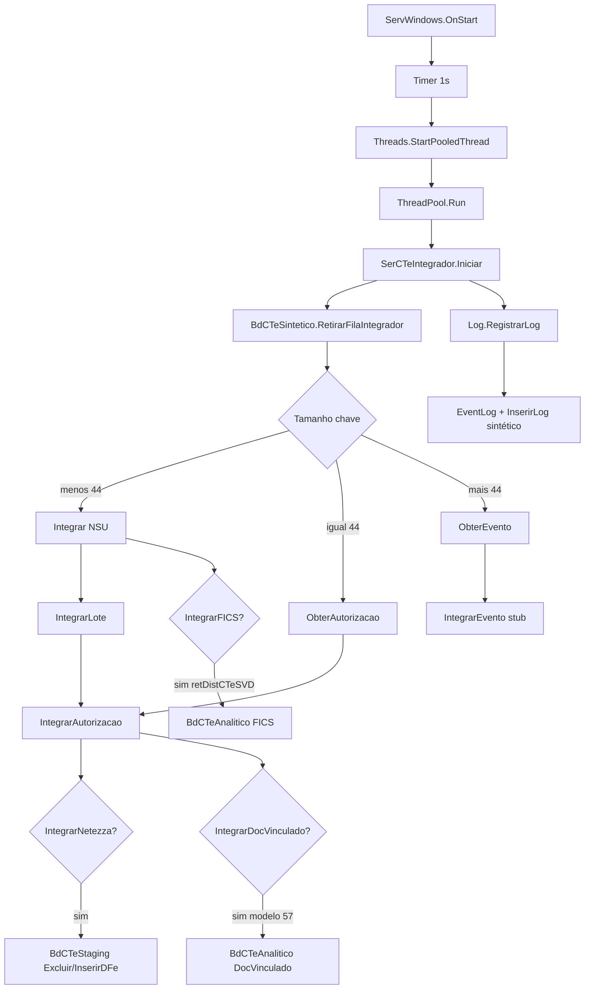
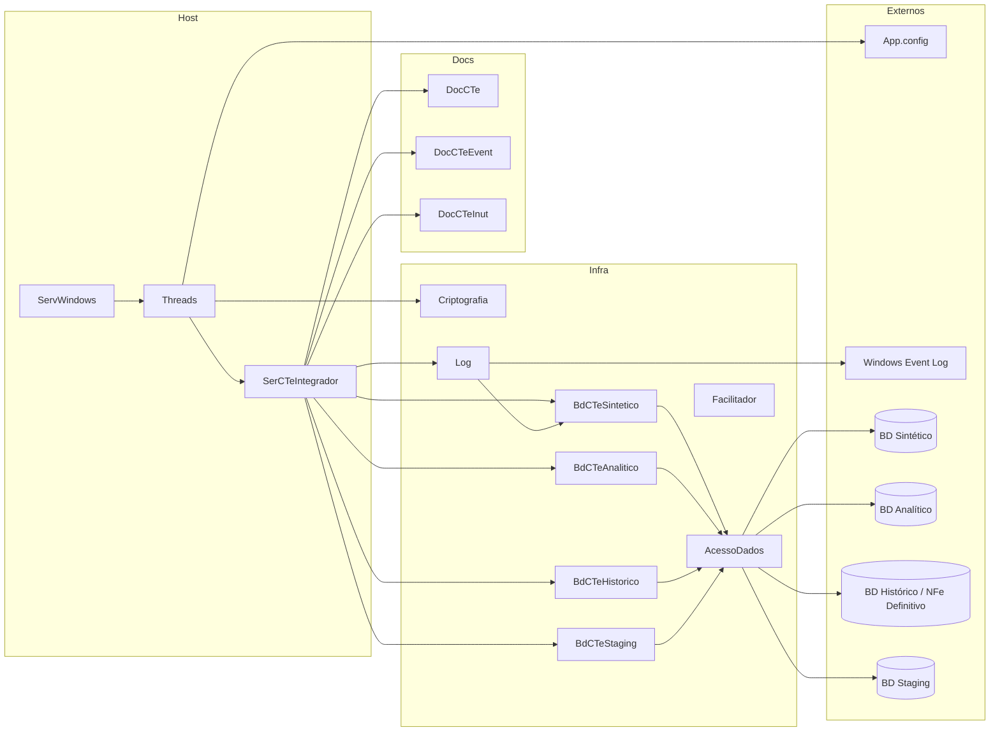
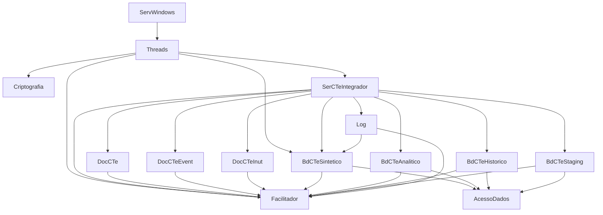
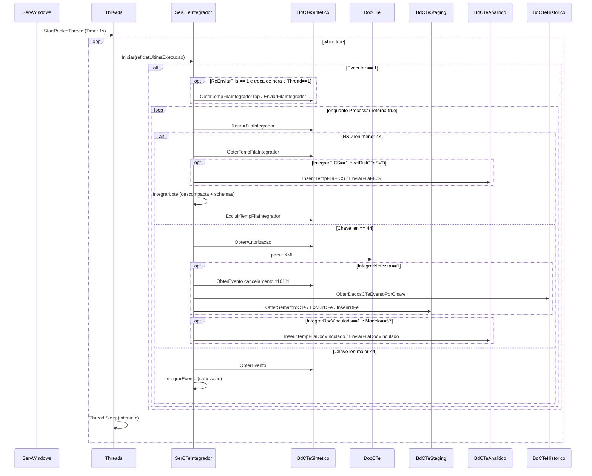
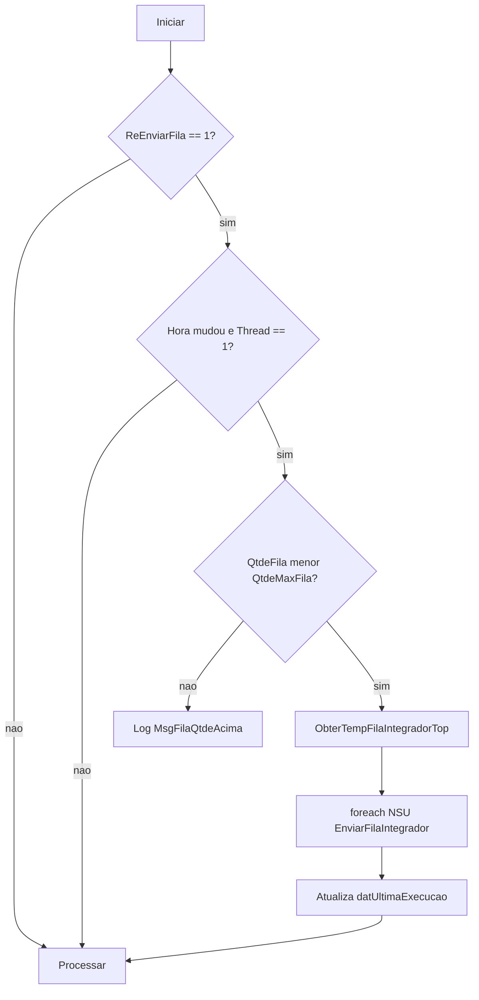
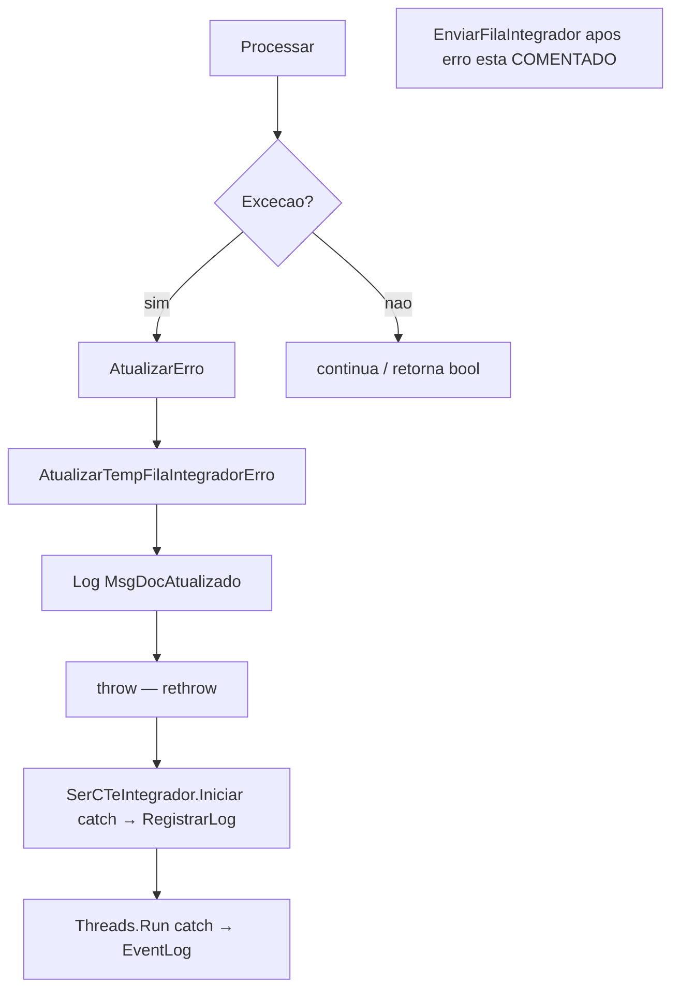
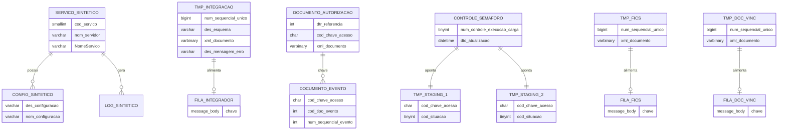
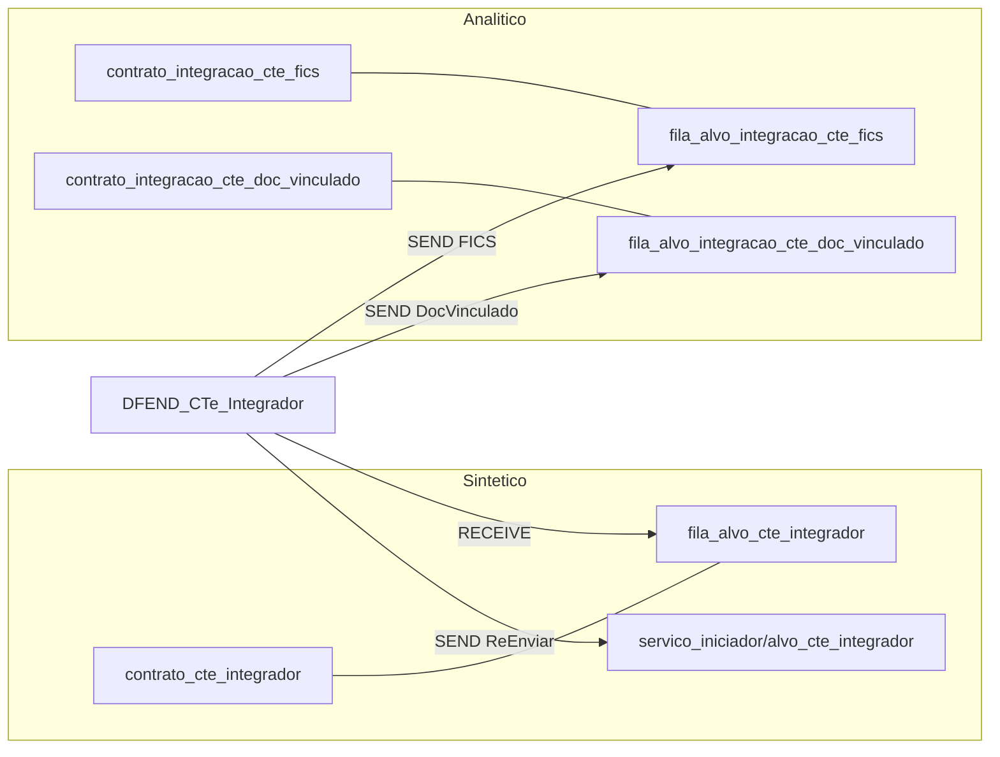
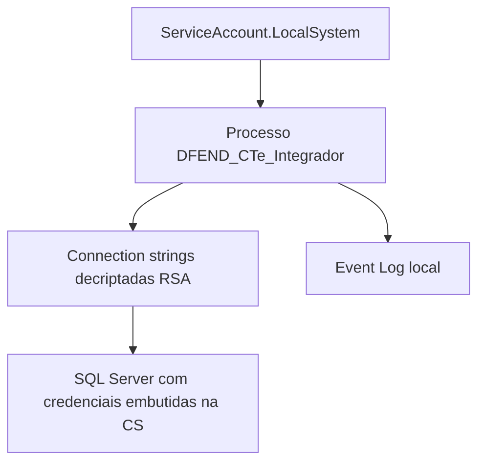
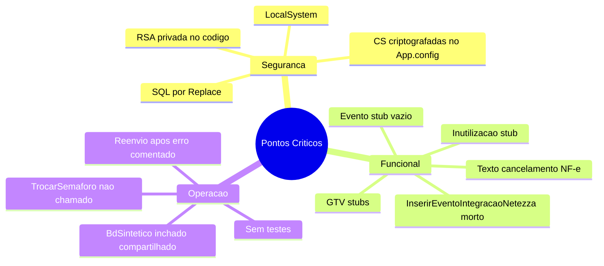

# DOCUMENTAÇÃO TÉCNICA — DFEND_CTe_Integrador (Versão 2.0)

| Campo | Valor |
|---|---|
| Sistema | DFEND_CTe_Integrador |
| Tipo | Windows Service (.NET Framework) |
| Assembly | `9.0.0` (`AssemblyInfo.cs`) |
| Empresa | SEFAZ (Bahia) |
| Repositório analisado | `dfend-cte-integrador-windowsservices` |
| Data da análise | 2026-07-25 |
| Modo | Somente leitura (código-fonte) |
| Destino deste arquivo | `...\5-Integrador\Doc\DOCUMENTACAO_TECNICA_DFEND_CTe_Integrador2.0.md` |

> **Legenda de marcadores:** ✅ Comprovado pelo código · 🧠 Inferência técnica · ❓ Não confirmado · ⚠️ Atenção · 🚨 Problema · 🔒 Vulnerabilidade · 💪 Ponto forte

---

## 00 — Roteiro de Estudo

Leitura sugerida para um desenvolvedor novo:

1. **Seções 01–04** — entender o que o serviço faz e o contexto CT-e/SEFAZ.
2. **Seções 05–08** — estrutura, projetos, tecnologias e arquitetura real.
3. **Seção 11 (Fluxos)** — acompanhar o caminho do timer até Netezza/FICS/DocVinculado.
4. **Seção 12 (Regras)** — regras RN-xxx com evidências.
5. **Seções 13–15** — bancos, filas Service Broker e segurança.
6. **Seções 24–29** — dívidas, riscos e plano de evolução.

Arquivos essenciais (ordem de leitura do código):

1. `ServWindows.cs` → entrada do Windows Service  
2. `Threads.cs` → pool de threads e configuração  
3. `SerCTeIntegrador.cs` → orquestração do ciclo de integração  
4. `DocCTe.cs` / `DocCTeEvent.cs` / `DocCTeInut.cs` → parsers XML  
5. `BdCTeSintetico.cs` → fila integrador + documentos sintéticos  
6. `BdCTeAnalitico.cs` → filas FICS / DocVinculado  
7. `BdCTeStaging.cs` → staging Netezza (semáforo + tmp)  
8. `BdCTeHistorico.cs` → fallback histórico (BDNFeDefinitivo)  
9. `AcessoDados.cs` / `Facilitador.cs` / `Criptografia.cs` / `Log.cs` / `Constante.cs`

---

## 01 — Resumo Executivo

✅ O **DFEND_CTe_Integrador** é um **Windows Service** (.NET Framework 4.7) da SEFAZ-BA que consome mensagens da fila Service Broker `fila_alvo_cte_integrador`, classifica a chave por tamanho (NSU / chave 44 / evento composto) e **integra autorizações CT-e** para:

- **Staging Netezza** (`IntegrarNetezza == 1`) — insert em tabelas temporárias controladas por semáforo;
- **Documento vinculado** (`IntegrarDocVinculado == 1` e modelo `57`) — temp + fila no analítico;
- **FICS** (`IntegrarFICS == 1` e esquema `retDistCTeSVD`) — temp + fila no analítico.

✅ Não há API HTTP, controllers, GraphQL, Kafka ou Redis neste repositório. A “entrada” é o ciclo do serviço + `RECEIVE` na fila do integrador.

🚨 Há dívidas críticas: integrações de **evento / inutilização / GTV** vazias; método `InserirEventoIntegracaoNetezza` **nunca chamado**; chave RSA privada no código; SQL por concatenação/`Replace`; execução como `LocalSystem`; **zero testes**; texto de cancelamento herda mensagem de **NF-e** em serviço CT-e.

---

## 02 — Objetivo do Sistema

✅ **Objetivo comprovado pelo código:** integrar documentos CT-e retirados da fila do integrador, com foco em **autorização** (staging Netezza e/ou documento vinculado) e, no nível de lote, **encaminhamento FICS** quando habilitado.

Evidências:

- `AssemblyDescription("Serviço Integrador de CT-e")` — `Properties/AssemblyInfo.cs`
- Fluxo `SerCTeIntegrador.Processar` → `Integrar` / `ObterAutorizacao` / `ObterEvento` — `Classes CTe/SerCTeIntegrador.cs`
- Flags `IntegrarNetezza`, `IntegrarDocVinculado`, `IntegrarFICS` lidas do BD sintético — `ObterConfigBanco()`

---

## 03 — Contexto de Negócio

✅ Comprovado:

- Domínio: **Documentos Fiscais Eletrônicos (DF-e)**, especificamente **CT-e** (modelo `57`) e schemas GTV-e / CT-e OS / CT-e Simplificado no parser — `Constante.cs`, `DocCTe.cs`.
- Órgão: **SEFAZ / UF BA** (`CodUFBA = "29"`, `AssemblyCompany = "SEFAZ"`).
- Produto/família: **DFEND** (`VersaoDFEND = "SFZBA_DFEND"`).
- Código do serviço no banco: `CodServicoIntegrador = 7` (`App.config`).
- Evento de cancelamento: `TipoEvento.Cancelamento = 110111`.

🧠 Inferência técnica: o integrador é o elo pós-síntese/análise no ecossistema DFEND CT-e — consome a fila do integrador (alimentada por outro serviço) e empurra dados para staging analítico (Netezza), FICS e documento vinculado.

❓ Não confirmado: contrato formal de negócio, SLAs, volume esperado, donos de produto, diagramas institucionais, processo ETL Netezza que consome as tabelas `tmp_*_primeira/segunda`.

---

## 04 — Visão Geral

```text
[Windows Service DFEND_CTe_Integrador]
        │
        ▼ (Timer 1s — bootstrap)
[Threads / ThreadPool]
        │
        ▼ loop while(true)
[SerCTeIntegrador.Iniciar]
        │
        ├─ (opcional) ReEnviarFila (1x/hora, thread 1)
        │
        ▼ while houver mensagem
[RECEIVE fila_alvo_cte_integrador]
        │
        ├─ len < 44  → Integrar(NSU) → temp + IntegrarLote (+ FICS opcional)
        ├─ len == 44 → ObterAutorizacao → IntegrarAutorizacao
        └─ len > 44  → ObterEvento → IntegrarEvento (corpo vazio)
                │
                ▼ (autorização)
        ├─ IntegrarNetezza=1 → ExcluirDFe + InserirDFe (staging)
        └─ IntegrarDocVinculado=1 + Modelo=57 → temp + fila DocVinculado
```

✅ Tipo de aplicação: `WinExe` + `System.ServiceProcess` (`DFEND_CTe_Integrador.csproj`, `ServWindows : ServiceBase`).  
✅ Startup: `DFe.ServWindows` (`StartupObject`).  
✅ Nome do serviço Windows: `DFEND_CTe_Integrador` (`ServWindows.Designer.cs`, `ProjectInstaller.Designer.cs`).  
✅ Conta: `LocalSystem` (`ProjectInstaller.Designer.cs`).

---

## 05 — Estrutura do Repositório

### Árvore resumida (somente itens relevantes)

```text
dfend-cte-integrador-windowsservices/
├── azure-pipelines.yml
├── DFEND_CTe_Integrador.sln   (ou solution equivalente no root)
└── DFEND_CTe_Integrador/
    ├── App.config
    ├── App.Release.config
    ├── AppConfig/
    │   ├── Desenvolvimento/DFEND_CTe_Integrador.exe.config
    │   ├── Homologacao/DFEND_CTe_Integrador.exe.config
    │   └── Producao/DFEND_CTe_Integrador.exe.config
    ├── Bibliotecas/
    │   ├── AcessoDados.cs
    │   ├── Constante.cs
    │   ├── Criptografia.cs
    │   ├── Facilitador.cs
    │   └── Log.cs
    ├── Classes CTe/
    │   ├── BdCTeAnalitico.cs
    │   ├── BdCTeHistorico.cs
    │   ├── BdCTeSintetico.cs
    │   ├── BdCTeStaging.cs
    │   ├── DocCTe.cs
    │   ├── DocCTeEvent.cs
    │   ├── DocCTeInut.cs
    │   └── SerCTeIntegrador.cs
    ├── Properties/
    │   ├── AssemblyInfo.cs
    │   ├── Settings.Designer.cs
    │   └── Settings.settings
    ├── ProjectInstaller.cs / .Designer.cs / .resx
    ├── ServWindows.cs / .Designer.cs
    ├── Threads.cs
    └── DFEND_CTe_Integrador.csproj
```

✅ **Não encontrados no repositório:** Dockerfile, docker-compose, migrations SQL, README, projetos de teste, pastas `Controllers`, `wwwroot`, `package.json`.

✅ Controle de versão legado TFVC referenciado no `.csproj` (`Scc* = SAK`).  
✅ Remote Git atual: Azure DevOps `GDSAT_SPED_DFEN/_git/dfend-cte-integrador-windowsservices` (evidência de `git remote`).

---

## 06 — Projetos

| Projeto | Tipo | Framework | Papel |
|---|---|---|---|
| `DFEND_CTe_Integrador` | WinExe / Windows Service | .NET Framework **4.7** | Único projeto da solution |

✅ Namespace de runtime das classes principais: `DFe` (RootNamespace `DFEND_CTe_Integrador`).  
✅ AssemblyName: `DFEND_CTe_Integrador`.

### Dependências de assembly (csproj)

`System`, `System.Configuration`, `System.Configuration.Install`, `System.Core`, `System.EnterpriseServices`, `System.Management`, `System.Web.Extensions`, `System.Web.Services`, `System.Xml.Linq`, `System.Data.DataSetExtensions`, `Microsoft.CSharp`, `System.Data`, `System.ServiceProcess`, `System.Xml`.

❓ Pacotes NuGet externos: **não há** `packages.config` / `PackageReference` no projeto.

---

## 07 — Tecnologias

| Área | Tecnologia | Evidência | Marcador |
|---|---|---|---|
| Linguagem | C# | `*.cs` | ✅ |
| Runtime | .NET Framework 4.7 | `TargetFrameworkVersion`, `App.config` | ✅ |
| Host | Windows Service | `ServiceBase`, `ServiceInstaller` | ✅ |
| Banco | SQL Server (`SqlConnection`/`SqlCommand`) | `AcessoDados.cs` | ✅ |
| ORM | Nenhum (SQL textual) | classes `Bd*` | ✅ |
| Mensageria | SQL Server Service Broker | `BEGIN DIALOG` / `RECEIVE` / `SEND ON` | ✅ |
| Cache | Não | — | ✅ |
| Containers | Não | — | ✅ |
| Observabilidade | Event Log + tabela de log | `Log.cs`, `EventLog`, `InserirLog` | ✅ |
| CI | Azure Pipelines + template Sonar | `azure-pipelines.yml` | ✅ |
| Criptografia config | RSA 1024 (`RSACryptoServiceProvider`) | `Criptografia.cs` | ✅ |
| Compressão XML | GZip + Base64 (`procComp`) | `Facilitador.DescompactarProc` | ✅ |
| Staging DW | Tabelas tmp + semáforo | `BdCTeStaging.cs` | ✅ |

---

## 08 — Arquitetura

### Camadas reais (validadas por chamadas)

Não há Clean Architecture formal. A organização observada é **camadas por prefixo de classe** no mesmo assembly:

| Camada lógica | Classe | Responsabilidade |
|---|---|---|
| Host / Infra de processo | `ServWindows`, `ProjectInstaller` | Ciclo de vida do serviço Windows |
| Orquestração de concorrência | `Threads` | Lê config, sobe ThreadPool, loop infinito |
| Application / Service | `SerCTeIntegrador` | Gate de execução, fila, integração, erro, reenvio |
| Domain / Documents | `DocCTe`, `DocCTeEvent`, `DocCTeInut` | Parse XML → propriedades |
| Data Access | `BdCTeSintetico`, `BdCTeAnalitico`, `BdCTeHistorico`, `BdCTeStaging` + `AcessoDados` | SQL e Service Broker |
| Cross-cutting | `Facilitador`, `Log`, `Criptografia`, `Constante` | Utilitários, logs, crypto, constantes |

### Injeção de dependência

✅ **Não há** container DI.  
✅ Dependências criadas com `new` e passadas por construtor (`SerCTeIntegrador`, `Log`, classes `Bd*`).  
✅ Não há interfaces de repositório/serviço no projeto.

### Fluxo das camadas



---

## 09 — Diagramas

### 9.1 Arquitetura Geral



### 9.2 Dependências entre componentes



### 9.3 Fluxo Principal (integração)



### 9.4 Fluxo Alternativo (ReEnviarFila)



### 9.5 Fluxo de Erros



✅ Em `AtualizarErro`, o reenvio à fila (`EnviarFilaIntegrador`) está **comentado** — o item fica marcado com erro na temp, sem reenfileiramento automático.

### 9.6 Banco de Dados (ER lógico — objetos vistos no código)



Nomes reais (schema `cte` / filas Broker):

| Objeto lógico | Nome no código |
|---|---|
| Serviço sintético | `cte.servico_sintetico_conhecimento_transporte_eletronico` |
| Config sintético | `cte.configuracao_sintetico_conhecimento_transporte_eletronico` |
| Log sintético | `cte.log_sintetico_conhecimento_transporte_eletronico` |
| Temp integrador | `cte.tmp_integracao_conhecimento_transporte_eletronico` |
| Docs autorização/evento/inutilização | `cte.documento_conhecimento_transporte_eletronico_*` |
| Fila integrador | `fila_alvo_cte_integrador` |
| Semáforo staging | `cte.controle_execucao_carga_conhecimento_transporte_eletronico` |
| Staging tmp | `cte.tmp_conhecimento_transporte_eletronico_primeira` / `_segunda` |
| Temp FICS | `cte.tmp_integracao_conhecimento_transporte_eletronico_fisc_icms` |
| Temp DocVinculado | `cte.tmp_integracao_conhecimento_transporte_eletronico_doc_vinculado` |
| Filas FICS / DocVinculado | `fila_alvo_integracao_cte_fics` / `fila_alvo_integracao_cte_doc_vinculado` |

### 9.7 Integrações (Service Broker)



### 9.8 Autenticação / Identidade do processo



✅ Não há autenticação de usuário final, OAuth, JWT ou certificados cliente no fluxo do serviço.  
🔒 Identidade efetiva: **LocalSystem** + credenciais nas connection strings criptografadas.

### 9.9 Pontos Críticos



---

## 10 — Componentes

### 10.1 `ServWindows` (`ServWindows.cs`)

✅ Host do Windows Service.  
✅ `OnStart`: Timer de **1000 ms**, dispara uma vez `Threads.StartPooledThread` e desabilita o timer (`finally` zera `tmrCronometro`).  
✅ Suporte a debug com `Debugger.IsAttached` → `StartDebug`.  
✅ `OnStop` / `OnPause` / `OnContinue` manipulam o timer (após o primeiro elapsed o timer já foi descartado — ⚠️ ciclo de vida frágil).

### 10.2 `Threads` (`Threads.cs`)

✅ Lê `App.config`: `NomeServico`, `CodServicoIntegrador`, `BDCTeSintetico`, `BDCTeAnalitico`, `BDNFeDefinitivo`, `BDStaging` (últimos 4 decriptados).  
✅ Lê do BD sintético: `Intervalo`, `Threads`, `NomeServico`; atualiza `nom_servidor` se máquina **não** começa com `"SF"`.  
✅ Cria N work items no `ThreadPool`; cada um executa `while(true)` → `SerCTeIntegrador.Iniciar` → `Sleep(Intervalo)`.

### 10.3 `SerCTeIntegrador`

✅ Orquestra: config, executar, reenviar fila, processar, integrar lote/autorização/evento, Netezza, DocVinculado, FICS, erro.  
🚨 Métodos stub: `IntegrarEvento`, `IntegrarInutilizacao`, `Integrar*GTV`.  
🚨 `InserirEventoIntegracaoNetezza` existe mas **não é chamado**.

### 10.4 `DocCTe`

✅ Parser XML de autorização (CT-e / CT-e OS / CT-e Simplificado) para propriedades usadas no staging e DocVinculado (chave, modelo, protocolo, emitente, ICMS, XMLs, etc.).

### 10.5 `DocCTeEvent` / `DocCTeInut`

✅ Parsers de evento e inutilização.  
⚠️ Instanciados nos stubs de integração, mas **nenhuma persistência** é feita no fluxo ativo de evento/inutilização.

### 10.6 `BdCTeSintetico`

✅ Acesso ao BD sintético: logs, serviço, config, documentos, filas sintetizador/analisador/**integrador**.  
⚠️ Contém métodos de filas **Sintetizador** e **Analisador** não usados pelo fluxo ativo do Integrador (código compartilhado/inchado).

### 10.7 `BdCTeAnalitico`

✅ Temp + Broker para **FICS** e **DocVinculado**; também contém APIs de log/serviço/config analítico (padrão espelho do sintético).

### 10.8 `BdCTeHistorico`

✅ Procedures `up_obter_dados_conhecimento_transporte_eletronico_*_por_chave` e inserts.  
✅ No fluxo ativo do Integrador: apenas **leitura** de evento de cancelamento e (no código morto) autorização.

### 10.9 `BdCTeStaging`

✅ Semáforo, insert/delete nas tmp Netezza.  
⚠️ `TrocarSemaforoCTe` (truncate via `up_truncar_tab_temporaria_bd`) **existe e não é chamado** por este serviço.

### 10.10 `AcessoDados`

✅ ADO.NET: `ExecutarQuery` / `ExecutarDataset`, transação Begin/Commit/Rollback.

### 10.11 `Facilitador`

✅ Utilitários XML/data/CNPJ + `AdicionarParametro` via **string.Replace** na query.

### 10.12 `Criptografia`

🔒 RSA com chave pública **e privada** como `const string` no código-fonte.

### 10.13 `Log`

✅ Event Log + insert em log sintético; flags `LogEvento` / `LogBanco` / `LogCompleto`.

### 10.14 `Constante`

✅ Modelos, schemas, mensagens, enums (`TipoEvento`, `TipoLog`, `TipoMensagem`, etc.). Volume alto (~1195 linhas).

### 10.15 `ProjectInstaller`

✅ `ServiceName` / `DisplayName` = `DFEND_CTe_Integrador`; `Account` = `LocalSystem`.

---

## 11 — Fluxos

### 11.1 Bootstrap do serviço

1. SCM inicia `DFEND_CTe_Integrador`.  
2. `OnStart` → Timer 1s → `Threads.StartPooledThread`.  
3. Decripta 4 connection strings; lê `Intervalo`/`Threads` do BD; sobe N threads em loop.

### 11.2 Configuração

| Origem | Chaves |
|---|---|
| App.config | `NomeServico`, `CodServicoIntegrador=7`, `BDCTeSintetico`, `BDCTeAnalitico`, `BDNFeDefinitivo`, `BDStaging` |
| BD sintético (cod_servico=7) | `NomeServico`, `Intervalo`, `Threads`, `LogEvento`, `LogBanco`, `LogCompleto`, `Executar`, `ReEnviarFila`, `QtdeMaxFila`, `IntegrarNetezza`, `IntegrarDocVinculado`, `IntegrarFICS` |

### 11.3 Processamento de uma mensagem (principal)

1. `RetirarFilaIntegrador` → string chave.  
2. Classificação por `Length`.  
3. Integração conforme ramo.  
4. Em sucesso de NSU: `ExcluirTempFilaIntegrador`.  
5. Em falha: `AtualizarTempFilaIntegradorErro` (sem reenvio).

### 11.4 Integração por tipo de schema (lote)

| Schema (prefixo) | Método | Comportamento ativo |
|---|---|---|
| `procCTe` | `IntegrarAutorizacao` | Netezza + DocVinculado (flags) |
| evento CT-e | `IntegrarEvento` | Stub vazio |
| inutilização CT-e | `IntegrarInutilizacao` | Stub vazio |
| GTV autorização/evento/inutilização | `Integrar*GTV` | Stub vazio |
| outro | — | `Exception MsgLoteElementoNaoEsperado` |

### 11.5 Integração Netezza (autorização)

1. Busca cancelamento `110111` no sintético e histórico.  
2. Se existir: `Status = "101"`, `Motivo = "Cancelamento de NF-e homologado"`.  
3. `ObterSemaforoCTe` → 1 ou 2.  
4. `ExcluirDFe` na tmp correspondente.  
5. `InserirDFe` com campos parseados de `DocCTe`.  
6. PK/duplicate → log informativo, sem throw.

### 11.6 FICS e DocVinculado

- **FICS:** no `Integrar(NSU)`, se flag e `des_esquema == retDistCTeSVD` → insert temp FICS + `SEND` fila FICS (antes de `IntegrarLote`).  
- **DocVinculado:** na autorização, se flag e `Modelo == "57"` → insert temp + `SEND` fila DocVinculado.

⚠️ Em `EnviarIntegracaoFICS`, o 3º parâmetro formal chama-se `strProtocolo`, mas a chamada passa `strQtde` (`qtd_documento` da temp) — evidência de possível inconsistência de dado gravado em `num_protocolo`.

---

## 12 — Regras de Negócio

### RN-001 — Execução condicionada à config `Executar`

✅ Se `Executar != 1`, apenas log `MsgProcessoNaoIniciado` e retorna.  
Evidência: `SerCTeIntegrador.Iniciar`.

### RN-002 — Reenvio horário de fila (thread 1)

✅ Se `ReEnviarFila == 1`, só na troca de hora e `intThread == 1`, reenvia NSUs da temp se `ObterQtdeFilaIntegrador() < QtdeMaxFila`.  
Evidência: `Iniciar` + `ReEnviarFila`.

### RN-003 — Roteamento por tamanho da chave

✅ `< 44` → NSU/lote; `== 44` → autorização por chave; `> 44` → evento composto (partes via `ObterParteChave`).  
Evidência: `Processar`.

### RN-004 — Integração FICS condicionada

✅ `IntegrarFICS == 1` **e** `des_esquema == Constante.EsqCTeRetSVD` (`retDistCTeSVD`).  
Evidência: `Integrar`.

### RN-005 — Classificação de itens do lote por schema

✅ Após `DescompactarProc`, prefixos `procCTe` / evento / inutilização / GTV*; schema vazio → `ObterEsquemaCTe`.  
Evidência: `IntegrarLote`.

### RN-006 — Integração Netezza só se flag ligada

✅ `IntegrarNetezza == 1` dispara `InserirAutorizacaoIntegracaoNetezza`.  
Evidência: `IntegrarAutorizacao`.

### RN-007 — Cancelamento marca status 101 na autorização

✅ Presença de evento `110111` no sintético **ou** histórico → `Status="101"` e motivo fixo com texto **NF-e**.  
🚨 Texto inadequado ao domínio CT-e.  
Evidência: `InserirAutorizacaoIntegracaoNetezza`.

### RN-008 — Semáforo define tabela staging

✅ Semáforo `2` → `tmp_..._segunda`; caso contrário → `tmp_..._primeira`.  
Evidência: `BdCTeStaging.InserirDFe` / `ExcluirDFe`.

### RN-009 — DocVinculado só modelo CT-e 57

✅ `IntegrarDocVinculado == 1` e `clsDoc.Modelo == Constante.ModeloCTe` (`"57"`).  
Evidência: `InserirAutorizacaoIntegracaoDocVinculado`.

### RN-010 — Evento / inutilização / GTV sem integração

✅ Corpos vazios com comentário “Nao existe integracao…”.  
Evidência: métodos `IntegrarEvento`, `IntegrarInutilizacao`, `Integrar*GTV`.

### RN-011 — Idempotência parcial por PK/duplicate

✅ Em Netezza, DocVinculado e FICS: exceção contendo `PRIMARY KEY` ou `DUPLICATE KEY` → log e engole.  
Evidência: catches em `InserirAutorizacaoIntegracao*`, `EnviarIntegracaoFICS`.

### RN-012 — Erro grava mensagem na temp (sem reenfileirar)

✅ `AtualizarTempFilaIntegradorErro`; `EnviarFilaIntegrador` comentado.  
Evidência: `AtualizarErro`.

### RN-013 — Atualização de nome do servidor

✅ Se `Environment.MachineName` não inicia com `"SF"`, atualiza servidor do serviço no BD.  
Evidência: `Threads.ObterConfigBancoCTeIntegrador`.

### RN-014 — Lote deve estar compactado

✅ `DescompactarProc` lança `"Lote não compactado"` se não houver `procComp`.  
Evidência: `Facilitador.DescompactarProc`.

### RN-015 — Código morto de reprocessamento de cancelamento via evento

✅ `InserirEventoIntegracaoNetezza` reobtém autorização e chama `InserirAutorizacaoIntegracaoNetezza`, mas **nunca é invocado** por `IntegrarEvento`.  
🚨 Cancelamentos chegam só “de passagem” quando a autorização é reprocessada e o evento já existe no BD.

---

## 13 — Banco de Dados

### 13.1 Schema

✅ Schema principal referenciado: `cte`.  
✅ Quatro connection strings lógicas: Sintético, Analítico, Histórico (`BDNFeDefinitivo`), Staging.

### 13.2 Tabelas / objetos tocados pelo fluxo ativo

| Banco lógico | Objeto | Uso |
|---|---|---|
| Sintético | `tmp_integracao_conhecimento_transporte_eletronico` | Leitura/exclusão/erro do lote |
| Sintético | `documento_conhecimento_transporte_eletronico_autorizacao` | `ObterAutorizacao` |
| Sintético | `documento_conhecimento_transporte_eletronico_evento` | `ObterEvento` / checagem cancelamento |
| Sintético | `servico_*` / `configuracao_*` / `log_*` | Config e log |
| Sintético | `fila_alvo_cte_integrador` | RECEIVE / COUNT / SEND |
| Analítico | `tmp_integracao_*_fisc_icms` | FICS |
| Analítico | `tmp_integracao_*_doc_vinculado` | DocVinculado |
| Analítico | filas `fila_alvo_integracao_cte_fics` / `_doc_vinculado` | SEND |
| Staging | `controle_execucao_carga_conhecimento_transporte_eletronico` | Semáforo |
| Staging | `tmp_conhecimento_transporte_eletronico_primeira/segunda` | Insert/Delete DFe |
| Histórico | procedures `up_obter_dados_*_por_chave` | Fallback cancelamento |

### 13.3 Objetos Service Broker (Integrador)

| Papel | Nome |
|---|---|
| Fila alvo | `fila_alvo_cte_integrador` |
| Contrato | `contrato_cte_integrador` |
| Serviços | `servico_iniciador_cte_integrador` → `servico_alvo_cte_integrador` |
| Message type | `tipo_mensagem_cte_integrador` |
| FICS | `contrato_integracao_cte_fics` / `tipo_mensagem_integracao_cte_fics` / serviços `*_integracao_cte_fics` |
| DocVinculado | análogo `*_integracao_cte_doc_vinculado` |

### 13.4 Configurações lidas do banco (por `cod_servico = 7`)

`LogEvento`, `LogBanco`, `LogCompleto`, `Executar`, `ReEnviarFila`, `QtdeMaxFila`, `IntegrarNetezza`, `IntegrarDocVinculado`, `IntegrarFICS`, `Intervalo`, `Threads`, `NomeServico`.

### 13.5 Transações

✅ Métodos Bd usam `BeginTransaction` / `Commit` / `Rollback` por operação ADO.  
❓ Não há Unit of Work abrangendo Netezza + Analítico + exclusão da temp no mesmo escopo — falhas parciais são possíveis.

### 13.6 Connection string

🔒 Quatro chaves criptografadas (RSA) no `App.config` e variantes AppConfig por ambiente.  
✅ Valores **não** são reproduzidos nesta documentação.  
✅ Decriptação em runtime via `Criptografia.Decriptar`.

### 13.7 Procedure de truncate (código presente, não chamado)

✅ `TrocarSemaforoCTe` executa `up_truncar_tab_temporaria_bd` na tmp “oposta” e atualiza semáforo 1↔2.  
❓ Quem chama esse método em produção (outro job/serviço) não está neste repositório.

---

## 14 — Integrações

| Integração | Tipo | Direção | Evidência | Status |
|---|---|---|---|---|
| Service Broker Integrador | SQL SB | Consome / produz (reenvio) | `RetirarFilaIntegrador` / `EnviarFilaIntegrador` | ✅ Ativo |
| Staging Netezza | SQL | Produz | `InserirDFe` / `ExcluirDFe` | ✅ Condicional |
| FICS | SQL SB + temp | Produz | `EnviarIntegracaoFICS` | ✅ Condicional |
| DocVinculado | SQL SB + temp | Produz | `InserirAutorizacaoIntegracaoDocVinculado` | ✅ Condicional |
| Histórico NFe Definitivo | SQL proc | Consome | `ObterDadosCTeEventoPorChave` | ✅ Leitura |
| Event Log | SO | Produz | `Log` / `EventLog.WriteEntry` | ✅ Ativo |
| HTTP / SOAP externo | — | — | — | ✅ Ausente |
| Kafka / Redis / Blob | — | — | — | ✅ Ausente |

🧠 Downstream consumidores das filas FICS/DocVinculado e do ETL Netezza **não** estão neste repositório.

---

## 15 — Segurança

### 15.1 Inventário

| Item | Situação | Marcador |
|---|---|---|
| Chave RSA privada no fonte | Presente em `Criptografia.cs` | 🔒 |
| Connection strings criptografadas no config | 4 chaves `BD*` | 🔒 |
| Conta do serviço | `LocalSystem` | 🔒 |
| SQL parametrizado real (`SqlParameter`) | Não — `Replace` textual | 🔒 |
| Secrets no repositório | Ciphertext no App.config + RSA no CS | 🚨 |
| Autenticação de usuário | Não aplicável (serviço batch) | ✅ |
| HTTPS / mTLS | Não | ✅ |
| Soft delete de logs | Methods de exclusão de log existem nos Bd | ⚠️ |

### 15.2 Detalhe — chave privada no código

🔒 `Criptografia.strChavePrivada` e `strChavePublica` são constantes embutidas.  
✅ Conteúdo das chaves **não** é reproduzido neste documento.  
🚨 Qualquer pessoa com acesso ao repositório pode decriptar as connection strings dos AppConfig.

### 15.3 Detalhe — “parâmetros” SQL

🔒 `Facilitador.AdicionarParametro` substitui `@nome` por literais (com escape parcial de aspas).  
🚨 Não usa `SqlParameter` do ADO.NET → risco clássico de injeção se valores vierem de XML/fila não confiáveis.

### 15.4 Conta LocalSystem

🔒 Privilégios elevados no host Windows; combinação com SQL injection aumenta impacto.

---

## 16 — Logs

### Canais

1. **Windows Event Log** (`EventLog.WriteEntry`) — bootstrap de threads e erros em `Threads`/`ServWindows`.  
2. **Tabela** `cte.log_sintetico_conhecimento_transporte_eletronico` via `BdCTeSintetico.InserirLog`.

### Níveis configuráveis (`Constante.TipoLog` / flags)

| Flag BD | Efeito |
|---|---|
| `LogEvento` | Liga escrita no Event Log via `Log` |
| `LogBanco` | Liga insert em tabela de log |
| `LogCompleto` | Inclui detalhe completo da exceção |

### Conteúdo montado (`Log.MontarMensagemLog`)

Tipo, mensagem (truncada ~1800), método, classe, aplicação, versão, thread, máquina.

### Classificação de exceções

✅ PK/duplicate tratados como informação (não Error) nos fluxos de insert.  
✅ Demais exceções sobem para `RegistrarLog(ex)` / EventLog Error.

---

## 17 — Tratamento de Erros

| Cenário | Comportamento | Marcador |
|---|---|---|
| Erro em `Processar` | `AtualizarErro` + rethrow | ✅ |
| Erro em `Iniciar` | `clsLog.RegistrarLog(ex)` engole | ✅ |
| Erro no loop da thread | EventLog Error; loop continua | ✅ |
| PK/duplicate Netezza/FICS/DocVinc | Log info; segue | ✅ |
| Schema inesperado no lote | `Exception` com `MsgLoteElementoNaoEsperado` | ✅ |
| Lote não compactado | `Exception` `"Lote não compactado"` | ✅ |
| Reenvio pós-erro | Comentado | 🚨 |
| Integração evento | Sem erro — no-op | 🚨 Funcional |

---

## 18 — Testes

✅ Projetos / pastas / arquivos de teste: **0**.  
✅ Frameworks xUnit/NUnit/MSTest: **ausentes**.  
✅ Cobertura automatizada: **inexistente**.

### Matriz Regra → Teste → Cobertura → Risco

| Regra | Teste existente | Cobertura | Risco |
|---|---|---|---|
| RN-001 Executar | Nenhum | 0% | Médio |
| RN-003 Roteamento por tamanho | Nenhum | 0% | Alto |
| RN-004 FICS | Nenhum | 0% | Alto |
| RN-006/007 Netezza + cancelamento | Nenhum | 0% | Crítico |
| RN-009 DocVinculado modelo 57 | Nenhum | 0% | Alto |
| RN-010 Stubs evento/GTV | Nenhum | 0% | Crítico (silêncio) |
| RN-011 Idempotência PK | Nenhum | 0% | Médio |
| Segurança SQL Replace | Nenhum | 0% | Crítico |

---

## 19 — Configuração

### AppSettings (arquivos)

| Chave | Observação |
|---|---|
| `NomeServico` | `DFEND_CTe_Integrador` |
| `CodServicoIntegrador` | `7` |
| `BDCTeSintetico` | Ciphertext RSA — **não exibido** |
| `BDCTeAnalitico` | Ciphertext RSA — **não exibido** |
| `BDNFeDefinitivo` | Ciphertext RSA — **não exibido** |
| `BDStaging` | Ciphertext RSA — **não exibido** |

✅ Variantes: `App.config`, `App.Release.config`, `AppConfig/{Desenvolvimento,Homologacao,Producao}/DFEND_CTe_Integrador.exe.config`.

### Configuração dinâmica (banco)

Ver seção 13.4. Alterações em `Executar`, flags de integração e `Threads`/`Intervalo` não exigem rebuild (somente restart/próximo ciclo da thread).

---

## 20 — Deploy

✅ Artefato: `DFEND_CTe_Integrador.exe` + `.exe.config`.  
✅ Instalação Windows Service via `ProjectInstaller` (InstallUtil / MSI legado — ❓ pipeline exato de instalação não está no repo).  
✅ `EnabledTaskTransformation: true` no pipeline indica transformação de config no CI.  
❓ Procedimento operacional de instalação/atualização em servidores SF* não documentado no código.

---

## 21 — CI/CD

✅ Arquivo: `azure-pipelines.yml`.

| Item | Valor |
|---|---|
| Trigger | batch; branches `main`, `master`, `develop` |
| Template | `templates/dotnet_framework_jobs.yml@template` |
| Repo templates | `GEPIN_AS/pipeline-templates` (ref `master`) |
| `EnabledTaskTransformation` | `true` |
| `SonarExclusions` | `$(SonarExclusions)` (variável externa) |
| AgentPool | comentado (default template) |

❓ Conteúdo interno do template (steps de build/Sonar/publicação) não versionado neste repositório.

---

## 22 — Performance

| Aspecto | Evidência | Avaliação |
|---|---|---|
| Concorrência | N threads (`Threads` config) | 💪 Escalável horizontalmente no processo |
| Fila | `RECEIVE TOP(1)` por ciclo | 🧠 Pode saturar com muitas threads no mesmo queue |
| Loop | `while (Processar())` até fila vazia | 💪 Bom para drenar backlog |
| Sleep | `Intervalo` entre ciclos vazios | ✅ Configurável |
| Staging | Delete + Insert por documento | 🧠 Custo por chave |
| SQL | Queries textuais, `READPAST` em vários SELECTs | 💪 Reduz bloqueio de leitura |
| Timer bootstrap | 1s único | ⚠️ Não é heartbeat contínuo |

---

## 23 — Escalabilidade

✅ Múltiplas threads no mesmo host (config `Threads`).  
🧠 Múltiplas instâncias em hosts distintos competindo na mesma fila Broker — possível, mas ❓ não há evidência de coordenação além de `READPAST`/RECEIVE.  
⚠️ Atualização de `nom_servidor` por máquina não-SF pode conflitar se várias instâncias usarem o mesmo `cod_servico`.  
✅ Semáforo staging externo ao serviço (tabela controle) sugere consumo single-writer por “lado” da tmp.

---

## 24 — Dívidas Técnicas

| # | Dívida | Severidade | Evidência |
|---|---|---|---|
| 1 | Integrações evento/inutilização/GTV vazias | Crítica | Stubs em `SerCTeIntegrador` |
| 2 | `InserirEventoIntegracaoNetezza` dead code | Alta | Sem callers |
| 3 | Secrets: RSA privada + CS no repo | Crítica | `Criptografia.cs`, App.config |
| 4 | SQL por `Replace` (não SqlParameter) | Crítica | `Facilitador.AdicionarParametro` |
| 5 | Zero testes | Alta | Repo |
| 6 | `BdCTeSintetico`/`BdCTeAnalitico` inchados (filas/métodos de outros serviços) | Média | Métodos sintetizador/analisador |
| 7 | Texto cancelamento “NF-e” em CT-e | Média | Motivo hardcoded |
| 8 | `TrocarSemaforoCTe` não usado neste serviço | Baixa/Média | Só definição |
| 9 | Reenvio após erro comentado | Alta | `AtualizarErro` |
| 10 | Possível troca Qtde↔Protocolo no FICS | Média | Assinatura vs chamada |
| 11 | Timer do serviço descartado após 1s | Média | `ServWindows.OnElapsedEvent` |
| 12 | Conta LocalSystem | Alta | Installer |

---

## 25 — Riscos Técnicos

| Risco | Impacto | Probabilidade | Marcador |
|---|---|---|---|
| Vazamento/decriptação de connection strings | Crítico | Alta (chave no código) | 🔒 |
| SQL Injection via XML/fila | Alto | Média | 🔒 |
| Cancelamento não reflete no staging se só o evento for processado | Alto | Alta (stub + dead method) | 🚨 |
| Eventos/GTV silenciosamente ignorados | Alto | Alta | 🚨 |
| Fila com itens em erro sem reprocesso automático | Médio | Alta | ⚠️ |
| Corrida multi-thread na mesma fila/temp | Médio | Média | 🧠 |
| Truncate de tmp por outro processo enquanto insert | Alto | ❓ | ❓ |

---

## 26 — Pontos Fortes

💪 Separação clara Ser / Doc / Bd / Bibliotecas.  
💪 Feature flags de integração (`IntegrarNetezza`, `IntegrarDocVinculado`, `IntegrarFICS`) sem redeploy de lógica.  
💪 Uso de Service Broker para desacoplar produtores/consumidores.  
💪 Semáforo de staging com tabelas duplas (padrão double-buffer).  
💪 Tratamento de duplicidade (PK) evita derrubar o ciclo.  
💪 CI Azure Pipelines + Sonar template já existentes.  
💪 Parser `DocCTe` rico para montar carga staging.

---

## 27 — Pontos Fracos

🚨 Stubs funcionais mascaram falta de integração de eventos.  
🚨 Segurança de secrets e SQL inadequada para padrões atuais.  
🚨 Ausência total de testes.  
⚠️ Código Bd compartilhado “copia-cola” aumenta superfície e ruído.  
⚠️ Mensagens de negócio herdadas de NF-e (`Constante` / motivo cancelamento).  
⚠️ Observabilidade limitada a Event Log + tabela (sem métricas/APM).  
⚠️ Ciclo de vida do ServiceBase/timer frágil para Pause/Continue após bootstrap.

---

## 28 — Recomendações

1. **Remover RSA do fonte** e usar secret store / DPAPI / Azure Key Vault; rotacionar CS.  
2. **Substituir `AdicionarParametro`** por `SqlParameter` reais.  
3. **Implementar ou remover** stubs de evento/inutilização/GTV; ligar `InserirEventoIntegracaoNetezza` ao `IntegrarEvento` se cancelamento deve atualizar staging.  
4. Corrigir motivo `"Cancelamento de NF-e homologado"` → texto CT-e.  
5. Criar suite mínima: roteamento por tamanho, flags, cancelamento 110111, DocVinculado modelo≠57, FICS schema.  
6. Extrair Bd compartilhados ou gerar biblioteca comum versionada.  
7. Revisar parâmetro FICS (`qtd` vs `protocolo`).  
8. Reduzir privilégio da conta do serviço (não LocalSystem).  
9. Reavaliar reenvio pós-erro (hoje comentado).  
10. Documentar/operacionalizar quem chama `TrocarSemaforoCTe`.

---

## 29 — Plano de Evolução

| Fase | Objetivo | Itens |
|---|---|---|
| P0 | Segurança | Secrets fora do código; SqlParameter; conta least-privilege |
| P1 | Correção funcional | Evento cancelamento → Netezza; texto CT-e; FICS param |
| P2 | Qualidade | Testes unitários parsers + regras; testes integração fila fake |
| P3 | Manutenção | Extrair libs comuns; remover dead code; limpar Bd inchado |
| P4 | Observabilidade | Métricas de fila, throughput, falhas; healthcheck |

---

## 30 — Glossário

| Termo | Significado no contexto |
|---|---|
| CT-e | Conhecimento de Transporte Eletrônico (modelo 57) |
| GTV-e | Guia de Transporte de Valores eletrônica (schemas no lote) |
| NSU | Número Sequencial Único |
| SVD | Distribuição (`retDistCTeSVD`) |
| FICS | Integração fiscal ICMS (`*_fisc_icms`) |
| DocVinculado | Encaminhamento de CT-e com documentos vinculados (NF-e) |
| Netezza / Staging | Área temporária de carga DW (`tmp_conhecimento_*`) |
| Semáforo | `num_controle_execucao_carga` (1 ou 2) escolhendo a tmp ativa |
| Service Broker | Mensageria nativa SQL Server |
| DFEND | Família de serviços fiscais SEFAZ-BA |
| CodServicoIntegrador | Código `7` na tabela de serviço sintético |
| 110111 | Código de evento de cancelamento |

---

## 31 — Conclusão Final

O **DFEND_CTe_Integrador 9.0.0** cumpre, no código, o papel de **consumir a fila do integrador e publicar autorizações CT-e** para staging Netezza, documento vinculado e FICS, sob feature flags lidas do banco.

A implementação ativa é essencialmente **centrada em autorização**; evento, inutilização e GTV são **no-ops**, e o caminho que reprocessaria cancelamento no staging a partir do evento está **morto**. Somado a secrets embutidos, SQL inseguro e ausência de testes, o serviço é operacionalmente útil porém **de alto risco** para evolução e auditoria.

---

## 32 — Escopo da Análise

### Plano executado

| Etapa | Status |
|---|---|
| 1 Mapeamento do repositório | ✅ |
| 2 Tecnologias | ✅ |
| 3 Arquitetura | ✅ |
| 4 Fluxos | ✅ |
| 5 Regras de negócio | ✅ |
| 6 Banco de dados | ✅ (apenas o inferível do SQL no código) |
| 7 Integrações | ✅ |
| 8 Segurança | ✅ |
| 9 Padrões | ✅ (abaixo) |
| 10 Qualidade | ✅ |
| 11 Performance | ✅ |
| 12 Testes | ✅ |
| 13 Dívidas | ✅ |

### Padrões de projeto (somente com evidência de comportamento)

| Padrão | Presente? | Evidência |
|---|---|---|
| Camadas Ser/Doc/Bd | ✅ | classes e chamadas |
| Repository (informal) | ✅ parcial | classes `Bd*` encapsulam SQL |
| Unit of Work formal | ❌ | só transação ADO por método |
| CQRS / Mediator | ❌ | — |
| Strategy | 🧠 leve | branches por schema / tamanho de chave |
| Factory | ❌ | — |
| Singleton | 🧠 parcial | `Settings.defaultInstance`; estado estático de thread counter |
| DI container | ❌ | `new` manual |
| Observer | ❌ | — (EventLog não conta) |
| Double-buffer | ✅ | semáforo + duas tabelas tmp staging |

### Métricas (comprovadas no repositório)

| Métrica | Quantidade |
|---|---|
| Solutions | 1 |
| Projetos | 1 |
| Arquivos `.cs` (sem bin/obj) | **20** |
| Linhas `.cs` (aprox.) | **~9026** |
| Controllers | 0 |
| Services (Ser*) | 1 (`SerCTeIntegrador`) |
| Parsers Doc* | 3 (`DocCTe`, `DocCTeEvent`, `DocCTeInut`) |
| Repositories/Bd | 4 (`Sintetico`, `Analitico`, `Historico`, `Staging`) + `AcessoDados` |
| DTOs tipados / ORM | 0 (`DataSet`/`DataRow` + classes Doc) |
| Endpoints HTTP | 0 |
| Integrações ativas | SQL + Service Broker + EventLog (+ staging) |
| Workers/Jobs | 1 Windows Service + N threads |
| Migrations | 0 no repo |
| Testes | **0** |
| Docker | 0 |
| Connection strings criptografadas | 4 |
| CodServicoIntegrador | 7 |
| AssemblyVersion | 9.0.0 |

### Linhas por arquivo principal (aprox.)

| Arquivo | Linhas |
|---|---|
| `BdCTeSintetico.cs` | ~1967 |
| `Constante.cs` | ~1195 |
| `DocCTe.cs` | ~968 |
| `Facilitador.cs` | ~931 |
| `BdCTeAnalitico.cs` | ~775 |
| `SerCTeIntegrador.cs` | ~669 |
| `BdCTeHistorico.cs` | ~580 |
| `BdCTeStaging.cs` | ~403 |
| `AcessoDados.cs` | ~394 |
| `DocCTeEvent.cs` | ~228 |
| `DocCTeInut.cs` | ~198 |
| `Log.cs` | ~195 |
| `Threads.cs` | ~166 |
| `ServWindows.cs` | ~128 |
| `Criptografia.cs` | ~69 |

### Limitações

- Sem acesso ao banco real / DDL / dados de configuração.  
- Sem execução do serviço (modo somente leitura).  
- Template de pipeline externo não versionado neste repo.  
- Valores criptografados e material RSA **não** foram decriptados/reproduzidos nesta análise (de propósito).

### Matriz de dependências de projetos

```text
(nenhuma)
DFEND_CTe_Integrador  (projeto único)
```

### Matriz de acoplamento (fluxo ativo)

```text
ServWindows → Threads → SerCTeIntegrador
                            ├─ DocCTe / DocCTeEvent / DocCTeInut
                            ├─ BdCTeSintetico  → AcessoDados → BD Sintético + Broker Integrador
                            ├─ BdCTeAnalitico  → AcessoDados → BD Analítico + Broker FICS/DocVinculado
                            ├─ BdCTeHistorico  → AcessoDados → BD Histórico (procs)
                            ├─ BdCTeStaging    → AcessoDados → BD Staging (semáforo/tmp)
                            └─ Log → EventLog + BdCTeSintetico.InserirLog
```

### Matriz de complexidade (classes principais)

| Classe | Linhas (aprox.) | Responsabilidade | Acoplamento | Complexidade | Risco |
|---|---|---|---|---|---|
| `BdCTeSintetico` | ~1967 | SQL/filas sintéticas | Alto | Alta | Alto (inchado) |
| `Constante` | ~1195 | Constantes globais | Baixo | Baixa (volume) | Médio (ruído NF-e) |
| `DocCTe` | ~968 | Parse autorização | Médio | Alta | Médio |
| `Facilitador` | ~931 | Utilitários + SQL replace | Alto | Alta | Crítico (SQL) |
| `BdCTeAnalitico` | ~775 | FICS/DocVinculado | Médio | Média | Médio |
| `SerCTeIntegrador` | ~669 | Orquestração | Alto | Alta | Alto (stubs/dead) |
| `BdCTeHistorico` | ~580 | Histórico | Baixo | Média | Médio |
| `BdCTeStaging` | ~403 | Semáforo/staging | Médio | Média | Alto (DW) |
| `AcessoDados` | ~394 | ADO/transação | Médio | Média | Alto |
| `Log` | ~195 | Logging | Médio | Baixa | Médio |
| `Threads` | ~166 | Concorrência | Médio | Média | Médio |
| `ServWindows` | ~128 | Host | Baixo | Baixa | Médio |
| `Criptografia` | ~69 | RSA | Baixo | Baixa | Crítico (chave) |

### Matriz Feature Flags → Efeito

| Flag BD | == 1 | == 0 / outro |
|---|---|---|
| `Executar` | Processa fila | Só log “não iniciado” |
| `ReEnviarFila` | Reenvia temp→fila 1x/hora (thread 1) | Não reenvia |
| `IntegrarNetezza` | Insert staging | Pula Netezza |
| `IntegrarDocVinculado` | Enfileira DocVinculado se modelo 57 | Pula |
| `IntegrarFICS` | Enfileira FICS se `retDistCTeSVD` | Pula |

---

*Fim da documentação técnica 2.0 — baseada exclusivamente no código-fonte do repositório `dfend-cte-integrador-windowsservices`.*
